# Implement a Custom ABAP AI Scenario Consuming SAP AI Core Orchestration Service in Your SAP S/4HANA System

<!-- description --> Learn how to implement an intelligent scenario including SAP AI Core's Orchestration Service features using the ABAP AI SDK powered by Intelligent Scenario Lifecycle Management (ISLM).

## You will learn

- How to create an Intelligent Scenario in the Intelligent Scenarios Application, including an Execution Flow Template
- How to deploy and activate the Intelligent Scenario in the Intelligent Scenario Management Application
- How to use the Intelligent Scenario in a simple ABAP class

## Prerequisites
You have successfully configured your system as described in [Set Up SAP BTP and Integrate SAP AI Core with ISLM](abap-islm-setup-oauth).

---

## Pre-Read
Beyond pure large language model (LLM) interactions, SAP AI Core features an orchestration service. Orchestration in SAP AI Core is a managed service that enables unified access, control, and execution of generative AI models through standardized APIs, templating, and configurable AI workflow components.

This allows you to enrich pure LLM interactions with additional capabilities such as data masking, content filtering, document grounding, and translation. Intelligent Scenario Lifecycle Management (ISLM) in ABAP can be used to leverage LLM interactions, including the consumption of orchestration features. The runtime APIs for this purpose are provided by the ABAP AI SDK powered by Intelligent Scenario Lifecycle Management.

> **NOTE:** In SAP AI Core, an orchestration deployment is available by default in the default resource group during the onboarding. For any new or additional resource groups, you must deploy a separate orchestration setup.

While orchestration in SAP AI Core offers a broader set of capabilities, this tutorial focuses on the consumption of the following modules: 
- model templating
- model configuration
- data masking
- input/output filtering
- output translation

Consumption of other orchestration service modules is optional.

Want to learn more? Please see the [Orchestration documentation](https://help.sap.com/docs/sap-ai-core/generative-ai/orchestration) for more information.

---

### Prepare the Execution Flow Template (optional)

**Goal:** Configure the custom configuration file for orchestration service consumption. 

The preparation of the execution flow template is an optional step in this tutorial. The described procedure yields the creation of a ```JSON``` file that will be used when creating the intelligent scenario. Therefore, you may safely proceed with the ```JSON``` file provided in the next step, i.e. **Create an Intelligent Scenario**.

1. Launch your SAP AI Launchpad application and navigate to `Generative AI Hub > Orchestration`
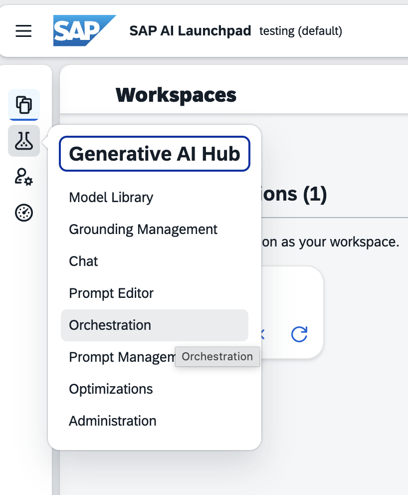

2. Create an Orchestration configuration


3. Choose the orchestration modules you would like to use by switching on via the respective slider
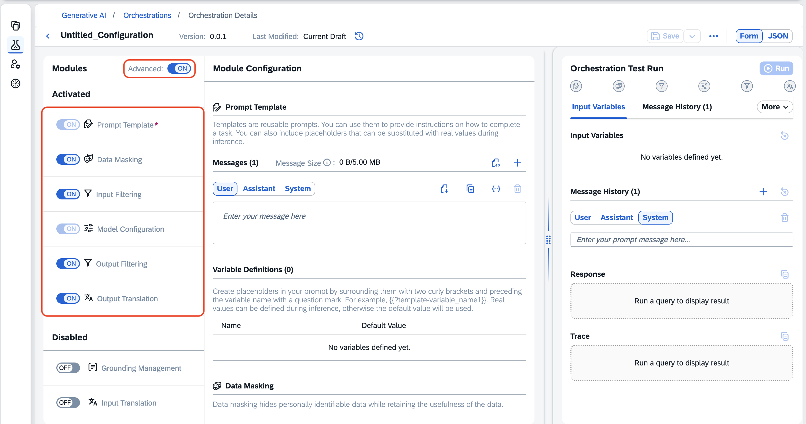

4. Select the large language model and version. You are free to choose any available model, but for this tutorial let's pick Antropic's `Claude 4 Sonnet`
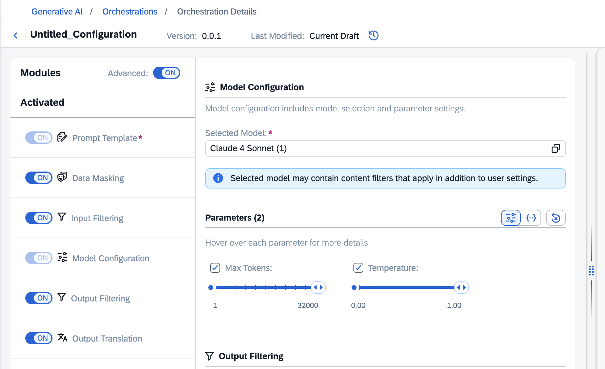

5. Next, configure the data masking module. Data masking ensures that sensitive data is filtered out before information is passed to the large language model. For example, sensitive data such as credit card numbers, email addresses, and similar information can be masked. In this tutorial, we mask all available data types. If you are also using the `Grounding Management Module`, you can additionally enable the `Apply to Grounding Input` option
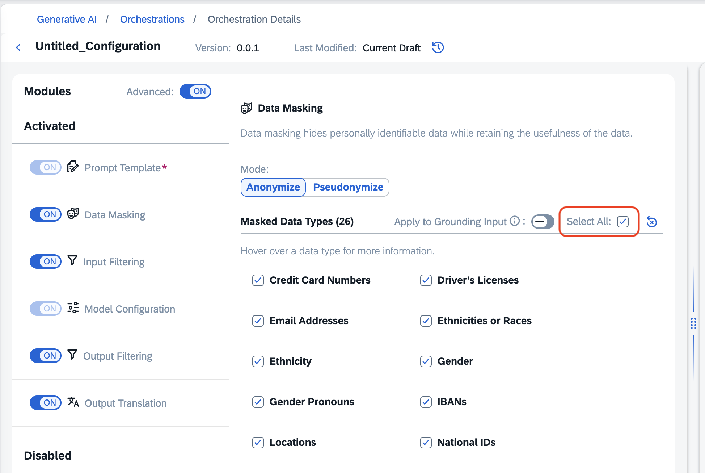

6. In addition to data masking, the orchestration service supports input and output filtering. The `Input Filtering` module can be configured to, for example, remove hate speech from user inputs
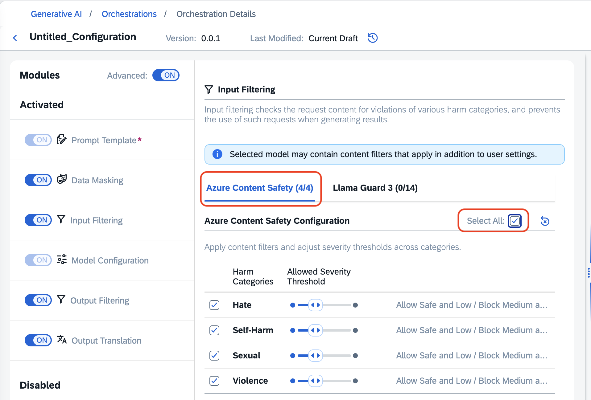
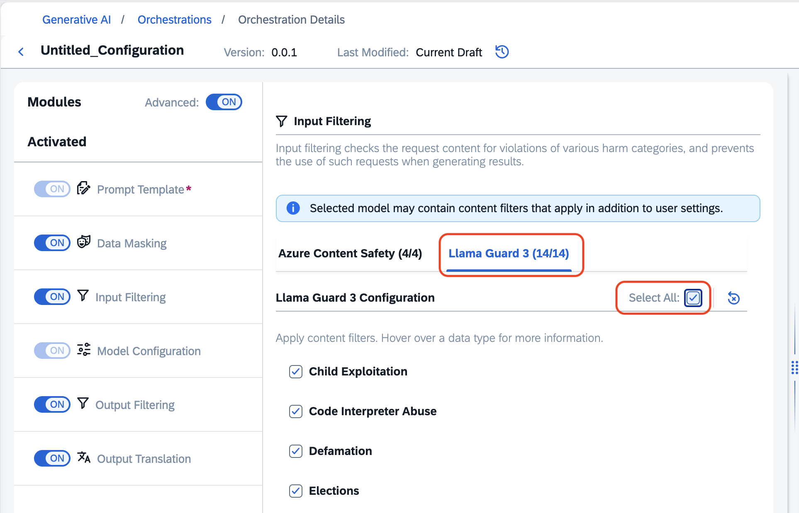

7. Like input filtering, the `Output Filtering` module filters the large language model's output before it is returned to the application. As with input filtering, let's enable all available filter options
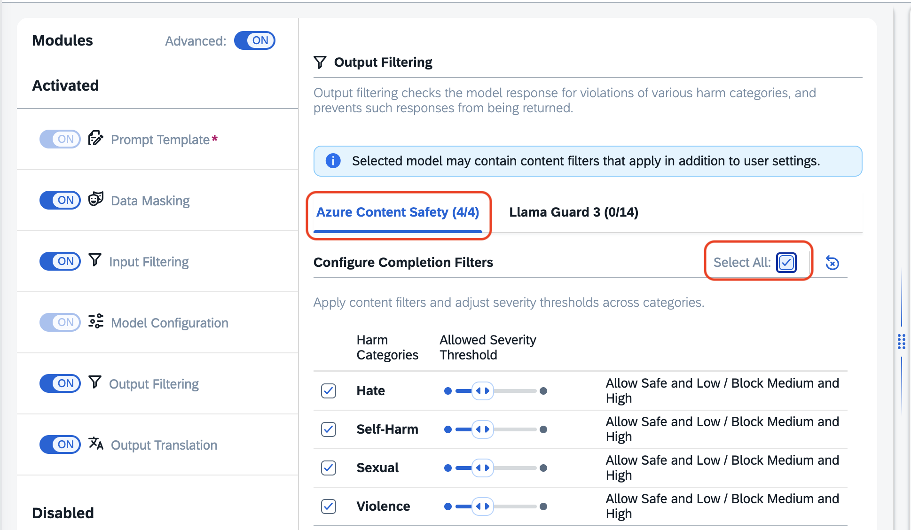
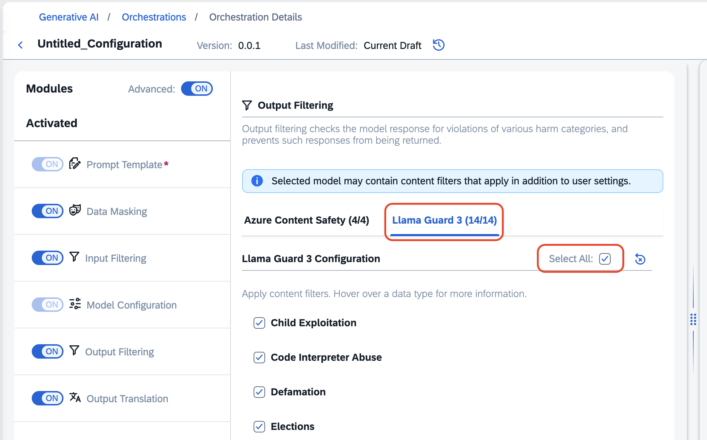

8. The default input and output language of the chosen LLM is English, but the actual language in the prompt may vary depending on the scenario. To address this, both input and output can be translated using the `Input Translation` and `Output Translation` modules. For simplicity, this tutorial uses only the `Output Translation` module, configured to translate responses to Spanish
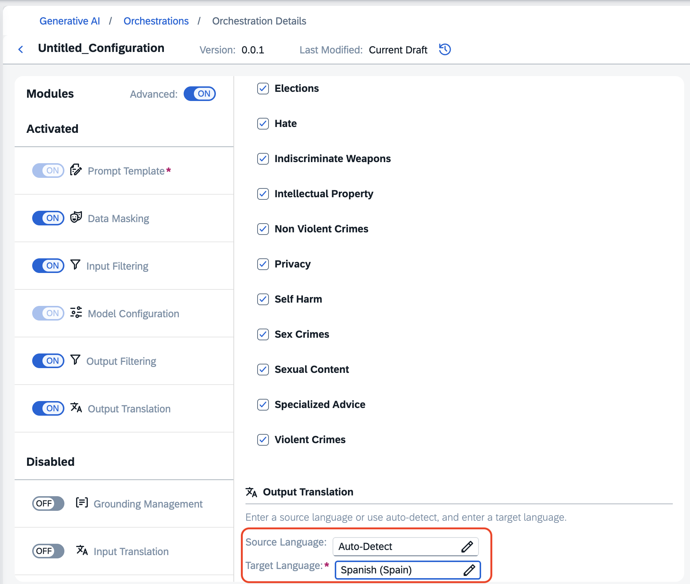 

9. Define a mandatory prompt template and save the orchestration configuration
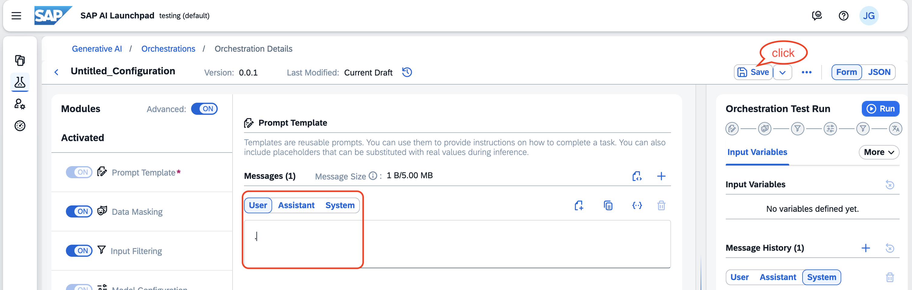
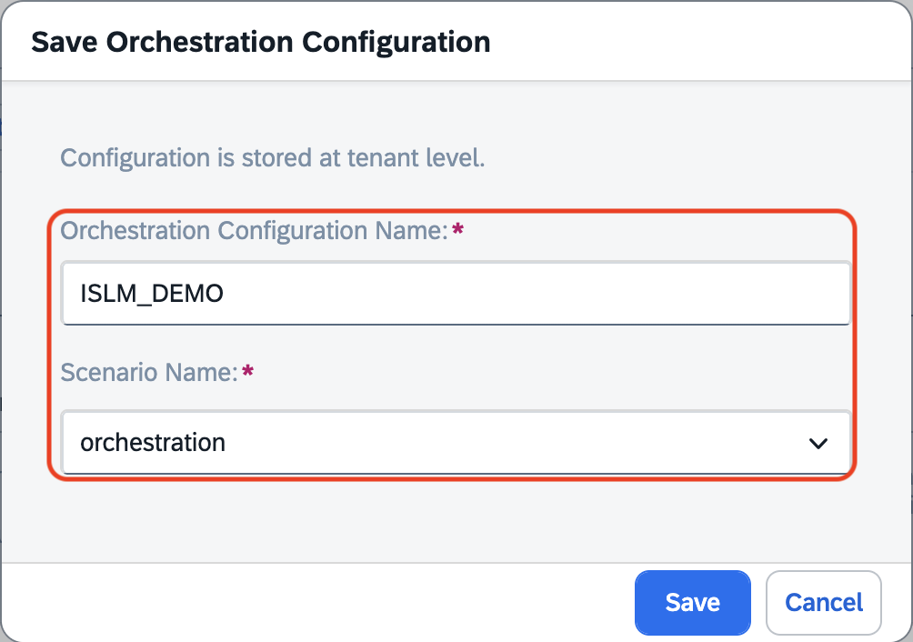

10. Finally, retrieve the orchestration configuration for later use in your custom ABAP AI application. Switch to the ```JSON``` view and copy the content
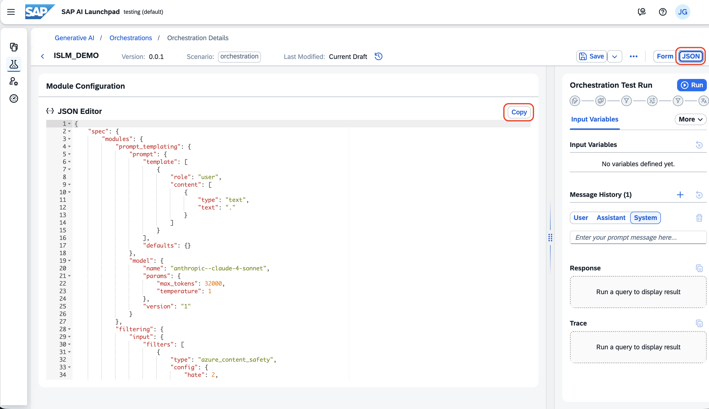

> **NOTE:** If you would like to know more about creation of orchestration configuration including how to test the configuration directly in the SAP AI Launchpad, please also check tutorial [Consumption of GenAI models Using Orchestration(V2) service - A Beginner's Guide](ai-core-orchestration-consumption-v2).


### Create an Intelligent Scenario

**Goal:** Create and publish the intelligent scenario, including the consumption of SAP AI Core's Orchestration Service modules.

1. In the SAP Fiori launchpad of your SAP S/4HANA system, choose the Intelligent Scenarios Fiori Application tile as shown below. Alternatively, you can start from SAP GUI using transaction ```F4469```.


2. Create a ```Side-by-Side``` intelligent scenario 
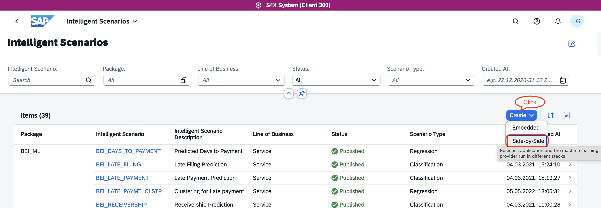

3. On the creation screen, first set the intelligent scenario type to ```Generative AI```, which updates the SAP Fiori creation screen accordingly. You can now fill in the mandatory fields for the intelligent scenario, e.g. the INTS name `ZDEMO_INTS_ORCH`. Make sure to also provide the ```Usage Type```.
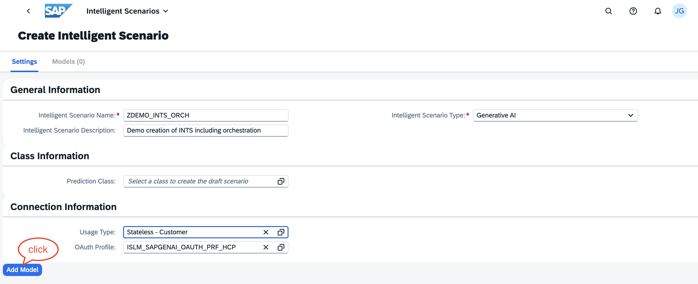

4. Click ```Add Model``` (see screenshot above) to open the configuration of the Intelligent Scenario Model (INTM), which will be named `ZDEMO_INTM_ORCH` in this tutorial. This model holds the details of the large language model. Choose from the list of supported providers and available models. Ensure you select the same model configured in the orchestration service
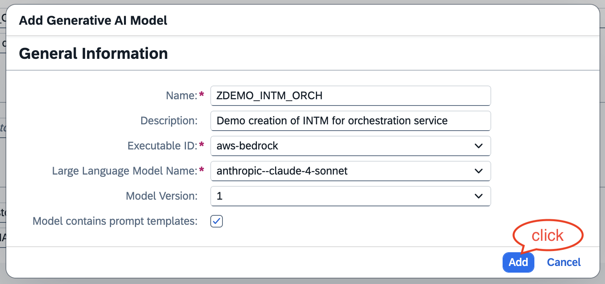

5. In order to consume SAP AI Core's Orchestration Service features, ISLM requires an execution flow template. Add the execution flow template
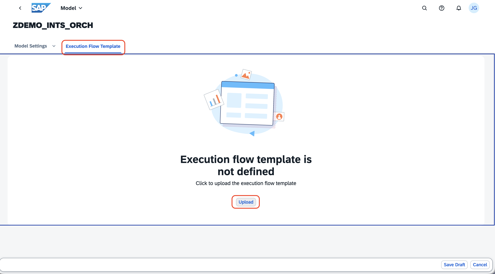

6. Provide the ```JSON``` file
```JSON
{
    "modules": {
        "prompt_templating": {
            "prompt": {
                "template": [
                    {
                        "role": "user",
                        "content": [
                            {
                                "type": "text",
                                "text": "."
                            }
                        ]
                    }
                ],
                "defaults": {}
            },
            "model": {
                "name": "anthropic--claude-4-sonnet",
                "params": {
                    "max_tokens": 32000,
                    "temperature": 1
                },
                "version": "1"
            }
        },
        "filtering": {
            "input": {
                "filters": [
                    {
                        "type": "azure_content_safety",
                        "config": {
                            "hate": 2,
                            "self_harm": 2,
                            "sexual": 2,
                            "violence": 2,
                            "prompt_shield": true
                        }
                    },
                    {
                        "type": "llama_guard_3_8b",
                        "config": {
                            "child_exploitation": true,
                            "code_interpreter_abuse": true,
                            "defamation": true,
                            "elections": true,
                            "hate": true,
                            "indiscriminate_weapons": true,
                            "intellectual_property": true,
                            "non_violent_crimes": true,
                            "privacy": true,
                            "self_harm": true,
                            "sex_crimes": true,
                            "sexual_content": true,
                            "specialized_advice": true,
                            "violent_crimes": true
                        }
                    }
                ]
            },
            "output": {
                "filters": [
                    {
                        "type": "azure_content_safety",
                        "config": {
                            "hate": 2,
                            "self_harm": 2,
                            "sexual": 2,
                            "violence": 2
                        }
                    },
                    {
                        "type": "llama_guard_3_8b",
                        "config": {
                            "child_exploitation": true,
                            "code_interpreter_abuse": true,
                            "defamation": true,
                            "elections": true,
                            "hate": true,
                            "indiscriminate_weapons": true,
                            "intellectual_property": true,
                            "non_violent_crimes": true,
                            "privacy": true,
                            "self_harm": true,
                            "sex_crimes": true,
                            "sexual_content": true,
                            "specialized_advice": true,
                            "violent_crimes": true
                        }
                    }
                ]
            }
        },
        "masking": {
            "masking_providers": [
                {
                    "type": "sap_data_privacy_integration",
                    "method": "anonymization",
                    "entities": [
                        {
                            "type": "profile-credit-card-number"
                        },
                        {
                            "type": "profile-driverlicense"
                        },
                        {
                            "type": "profile-email"
                        },
                        {
                            "type": "profile-sensitive-data"
                        },
                        {
                            "type": "profile-ethnicity"
                        },
                        {
                            "type": "profile-gender"
                        },
                        {
                            "type": "profile-pronouns-gender"
                        },
                        {
                            "type": "profile-iban"
                        },
                        {
                            "type": "profile-location"
                        },
                        {
                            "type": "profile-nationalid"
                        },
                        {
                            "type": "profile-nationality"
                        },
                        {
                            "type": "profile-org"
                        },
                        {
                            "type": "profile-passport"
                        },
                        {
                            "type": "profile-person"
                        },
                        {
                            "type": "profile-phone"
                        },
                        {
                            "type": "profile-political-group"
                        },
                        {
                            "type": "profile-sapids-public"
                        },
                        {
                            "type": "profile-religious-group"
                        },
                        {
                            "type": "profile-sapids-internal"
                        },
                        {
                            "type": "profile-ssn"
                        },
                        {
                            "type": "profile-sexual-orientation"
                        },
                        {
                            "type": "profile-trade-union"
                        },
                        {
                            "type": "profile-address"
                        },
                        {
                            "type": "profile-url"
                        },
                        {
                            "type": "profile-university"
                        },
                        {
                            "type": "profile-username-password"
                        }
                    ],
                    "mask_grounding_input": {
                        "enabled": true
                    },
                    "allowlist": []
                }
            ]
        },
        "translation": {
            "output": {
                "type": "sap_document_translation",
                "config": {
                    "source_language": "",
                    "target_language": "es-ES"
                }
            }
        }
    }
}
```
> **NOTE:** In case you use the ```JSON``` file copied from your SAP AI Core Launchpad Orchestration configuration, make sure you adapt to remove the outermost layer, hence the file should start with ```{ "modules"``` and adapt to ```"masking_providers"``` (instead of ```"providers"```).

7. Check the orchestration modules are configured as expected, namely the data masking, input and output filtering, and the output translation should be visible in your intelligent model. The last module requires the selection of the source and target language, which are set to English and Spanish in this tutorial
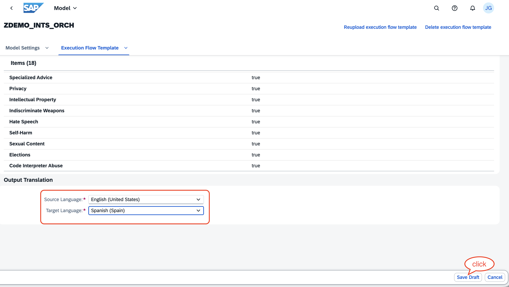

8. Navigate to the ```Model Settings``` and add prompt templates via the add option
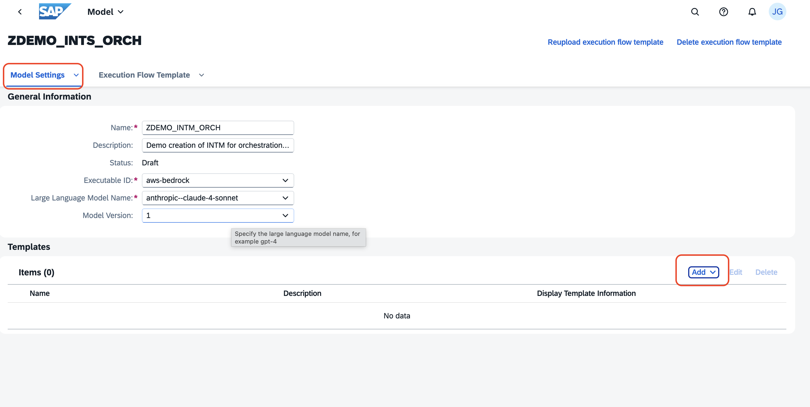

9. Provide a template for the system prompt
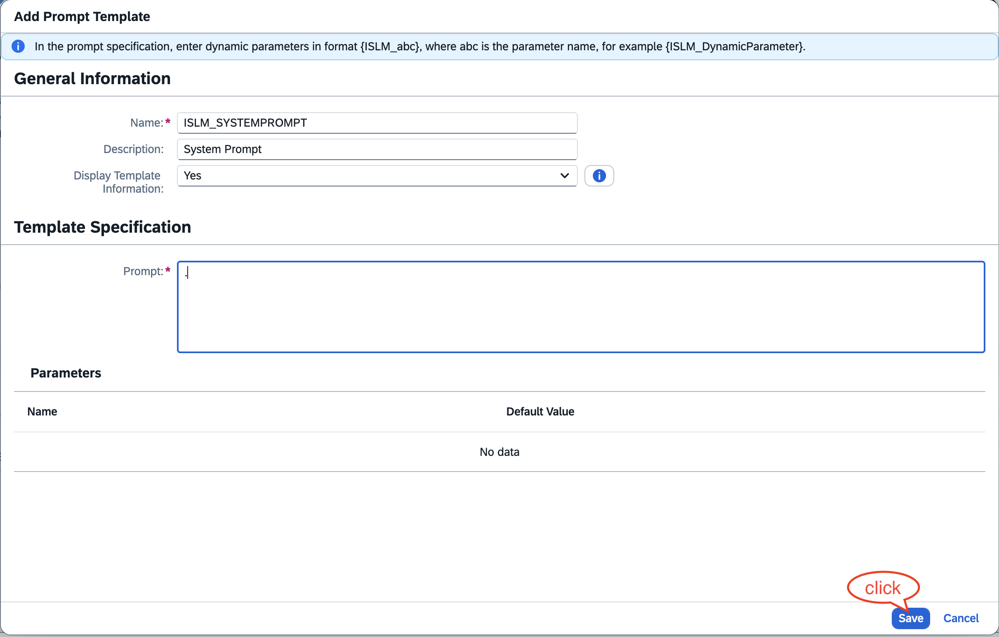

10. Provide a template for the user prompt
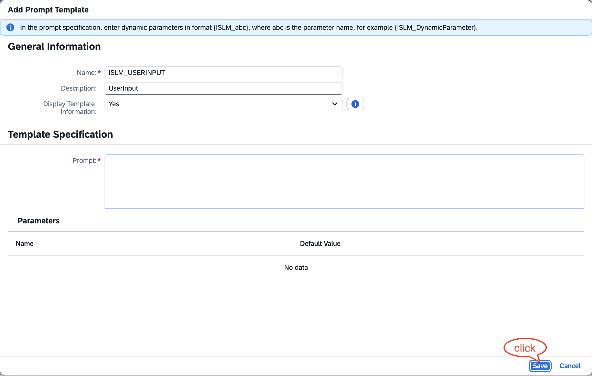

11. Safe the intelligent model draft 
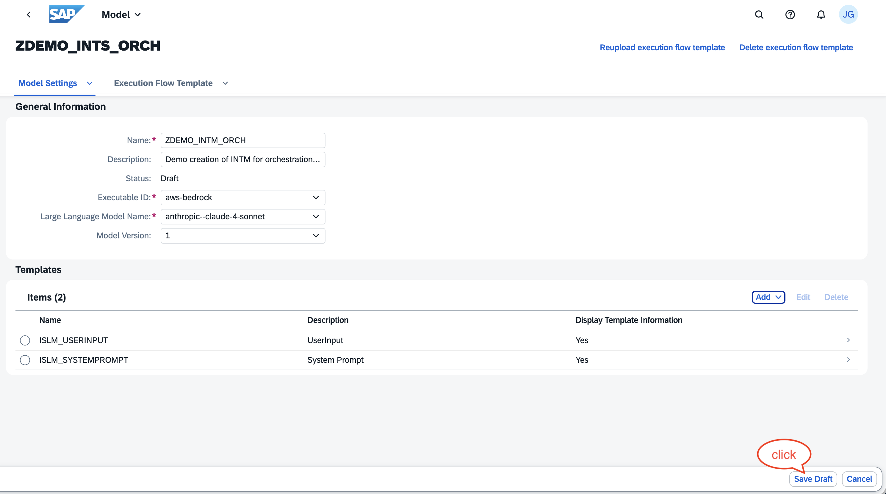

12. Navigate back to the intelligent scenario and publish it
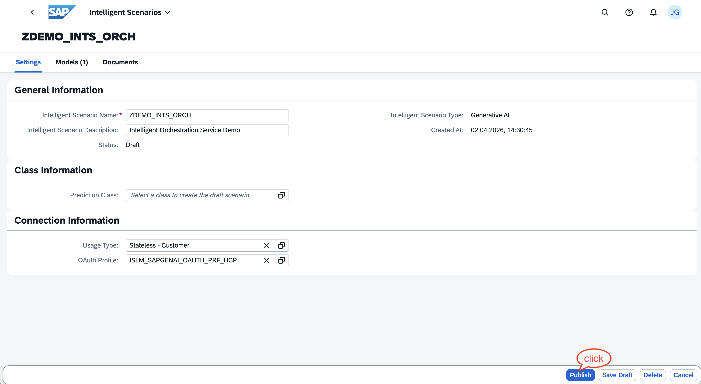

13. Select the appropriate package (this tutorial uses the ```$TMP``` package) 
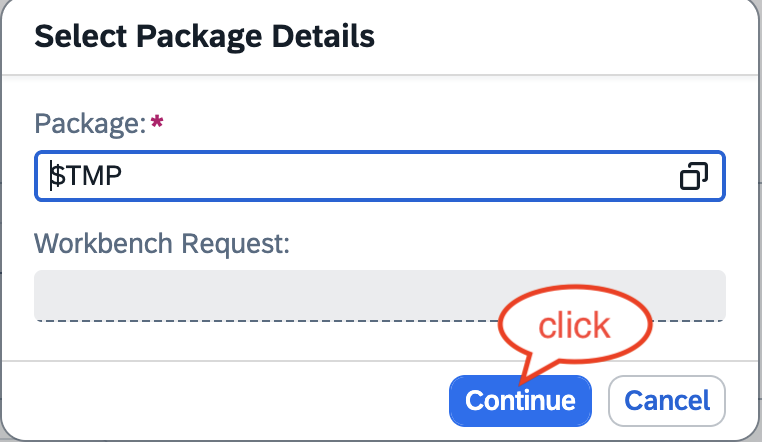

14. Confirm the intelligent scenario to be published
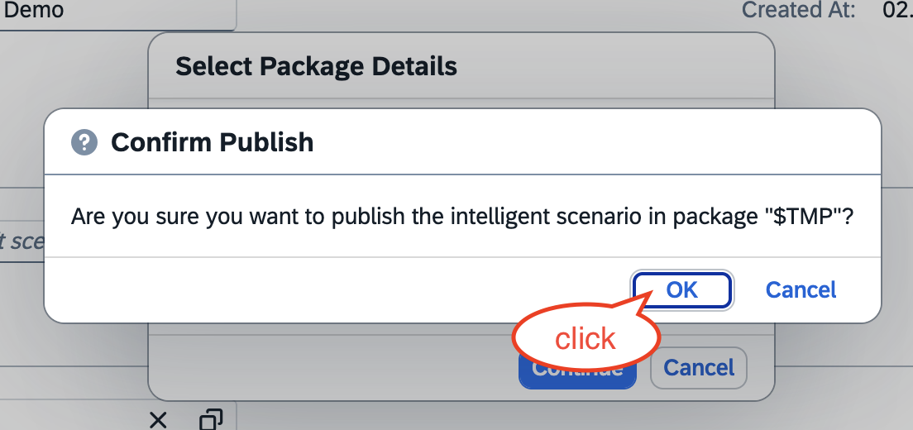


**Conclusion:** The intelligent scenario is now available in the ISLM framework. 


### Deploy and Activate the Intelligent Scenario

**Goal:** Continue with the deployment and activation of the newly created intelligent scenario to enable interactions with an LLM deployment.

Deploying the intelligent scenario creates a deployment in your SAP AI Core instance. This deployment is then used to interact with the large language model (LLM) defined in your intelligent scenario and its related intelligent scenario model.


1. Open the Intelligent Scenario Management Fiori tile in your SAP Fiori launchpad as shown below. Alternatively, you can start from SAP GUI using transaction ```F4470```
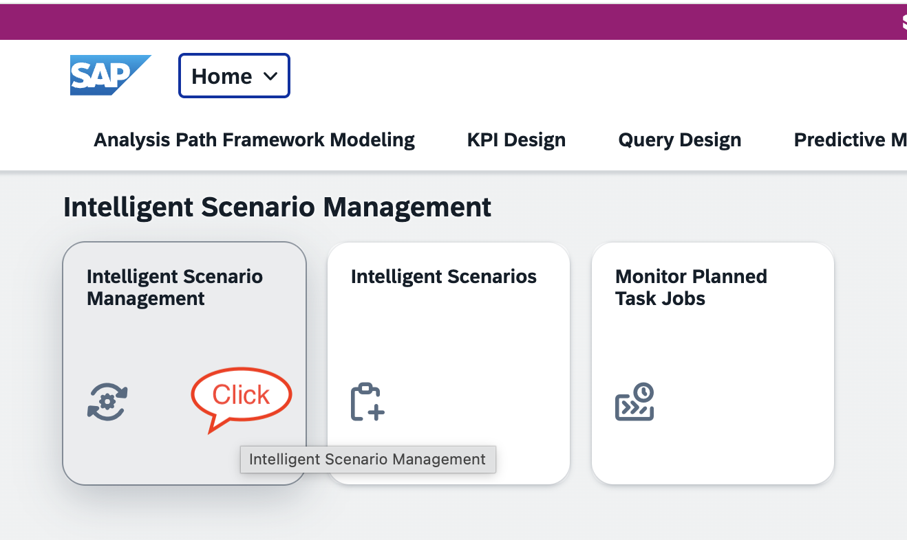

2. Select the previously created and published intelligent scenario. Open its detail screen by clicking the ```>``` icon. 
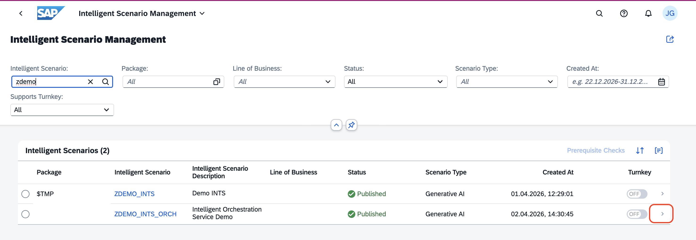
> **NOTE:** If you see a message about missing synchronization, this is expected and depends on your system configuration. There may be a delay before the required information is synced with your BTP AI Core instance (default: 5 minutes). You may need to wait up to 5 minutes for synchronization to complete.

3. Select an available training entry (there should be only one) and click ```Deploy``` to create an LLM deployment on SAP AI Core
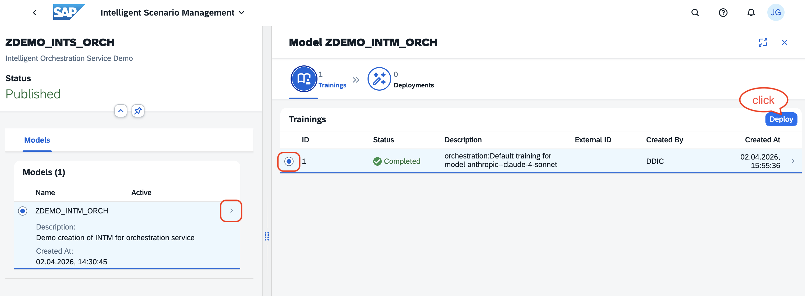

4. Check the deployment details displayed, you may change the deployment description or just accept the proposed text
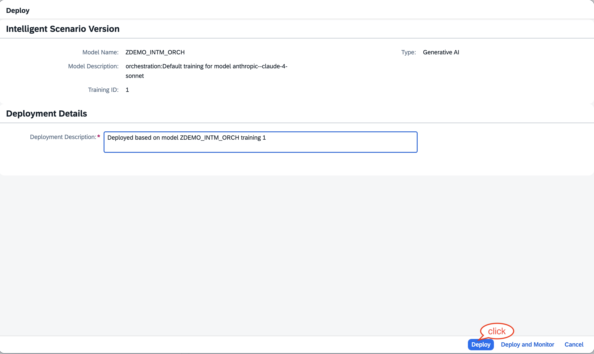

5. The deployment status will first change to a pending state, then to ```Deployed```. You can then activate the LLM deployment for all users via the ```For All``` option
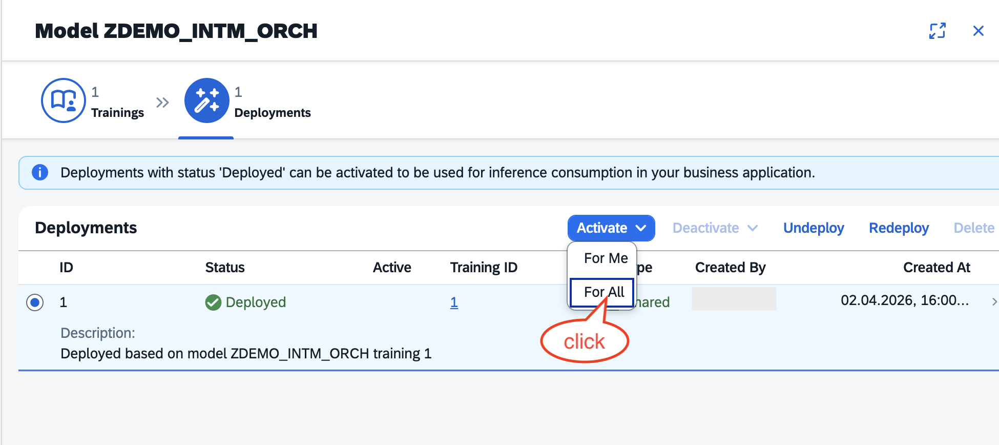

6. You'll be asked to confirm the activation method 
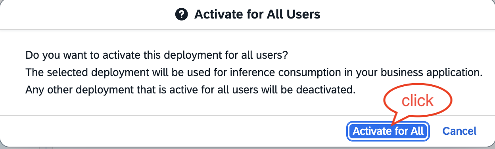

7. Finally, the LLM deployment is activated
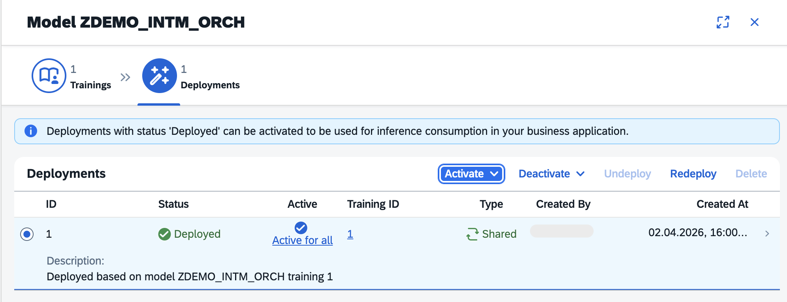

**Conclusion:** Well done! You are now ready to consume the intelligent scenario and interact with an LLM via SAP AI Core's Orchestration Service — let's do that in the next step!


### Consume the Intelligent Scenario in a Simple ABAP Class

**Goal:** Now that you have successfully published and activated the intelligent scenario, it is time to consume it in your ABAP code. For clarity, this tutorial uses a simple ABAP class with console output, but you can of course apply more complex ABAP logic.

1. Use ABAP Development Tools in Eclipse to create an ABAP class with the following code

``` ABAP
CLASS zdemo_islm_orch DEFINITION
  PUBLIC
  FINAL
  CREATE PUBLIC .

  PUBLIC SECTION.
  INTERFACES if_oo_adt_classrun.
  PROTECTED SECTION.
  PRIVATE SECTION.
    DATA: user_message TYPE string,
          system_role  TYPE string.

    CONSTANTS:
      ints    TYPE islm_de_sbs_is_name VALUE 'ZDEMO_INTS_ORCH'.
ENDCLASS.


CLASS zdemo_islm_orch IMPLEMENTATION.
  METHOD if_oo_adt_classrun~main.
    user_message = |Dear Joe, I'm Jane Doe, and I'm interested in joining your AI team. I have a basic understanding of computers | &&
                   |and I'm excited about AI.| &&
                   |Key highlights of my profile:| &&
                   |Completed an online course on basic computer skills (2015)| &&
                   |Familiar with Microsoft Office and Google Suite | &&
                   |Enjoy working with people and have experience in customer service | &&
                   |Willing to learn and take on new challenges | &&
                   |I'm looking for a new opportunity and think your team might be a good fit. Please find my resume attached. | &&
                   |Best regards,| &&
                   |Jane Doe | &&
                   |(jane.doe@email.com, 555-901-2345)|.
    system_role = |Briefly summarize the user input, i.e. give a personal description, | &&
                  |summarize and rate if this person | &&
                  |fits into our team of AI enthusiats.|.

    TRY.

        DATA(api) = cl_aic_islm_orch_api_factory=>get( )->create_instance( islm_scenario = ints ).

        api->configure_templating( )->add_user_message( user_message ).
        api->configure_templating( )->add_assistant_message( system_role ).
        api->configure_templating( )->add_prompt_template( template_id  = 'ISLM_USERINPUT'
                                                           message_type = aic_prompt_message_type=>user_message ).
        api->configure_templating( )->add_prompt_template( template_id  = 'ISLM_SYSTEMPROMPT'
                                                           message_type = aic_prompt_message_type=>system_role ).

        FINAL(response) = api->execute( )->orchestration_result( )->completion( ).

        out->write( response ).

      CATCH cx_aic_api_factory INTO DATA(cx_factory).
        out->write( cx_factory->get_longtext( ) ).
      CATCH cx_aic_orchestration_api INTO DATA(cx_orch).
        out->write( cx_orch->get_longtext( ) ).
      CATCH cx_aic_orch_api_aicore_int INTO DATA(cx_orch_int).
        out->write( cx_orch_int->get_longtext( ) ).

    ENDTRY.
  ENDMETHOD.

ENDCLASS.
```

2. Activate and run the ABAP class using `Run as > ABAP Application (Console)`. The ABAP console output will look similar to the following

```Text
**Resumen del aspirante:**

Parece ser una solicitud de empleo de alguien que expresa interés en unirse a un equipo de IA. Sin embargo, el mensaje contiene varios reserva-espacios de enmascaramiento (MASKED_PERSON, MASKED_PRONOUNS_GENDER, MASKED_EMAIL) que ocultan la identidad y los detalles clave del solicitante.

**Perfil personal:**
- Alfabetización informática básica (curso en línea completado en 2015)
- Competente en Microsoft Office y Google Suite
- Contexto de servicio al cliente
- Fuertes habilidades interpersonales
- Demuestra voluntad de aprender

**Evaluación de aptitud para el equipo: 2/5**

**Preocupaciones:**
- Contexto técnico muy limitado para un rol de IA
- La capacitación en habilidades informáticas tiene casi una década
- Sin mención de programación, matemáticas o conocimientos específicos de IA
- Brecha de habilidades significativa en comparación con los requisitos típicos del equipo de IA

**Positivos:**
- Entusiasta actitud hacia la IA
- La experiencia de servicio al cliente podría ser valiosa para los productos de IA orientados al usuario
- Establece explícitamente la disposición a aprender

**Recomendación:** Este candidato necesitaría capacitación y desarrollo sustanciales para contribuir significativamente a un equipo de IA. Considere los roles de soporte o de entrada si la organización tiene programas de mentoría sólidos, pero probablemente no sean adecuados para puestos de desarrollo técnico de IA sin una preparación adicional significativa.
```

### Test yourself

---


