# Enhance ISLM Connectivity to SAP AI Core with mTLS
<!-- description --> Enable certificate-based authentication for Intelligent Scenario Lifecycle Management (ISLM) to communicate with SAP AI Core.

## Prerequisites
- You have access to an SAP BTP subaccount with administrative permissions
- You have completed the tutorial [Set Up SAP BTP and Integrate SAP AI Core with ISLM](abap-islm-setup-oauth)


## You will learn
- Generate and manage client certificates in SAP BTP
- Enable certificate-based authentication and extend the SAP AI Core integration with mTLS
- Update the ISLM reuse connection in SAP S/4HANA to use mTLS

---

### Overview
In this tutorial, you enhance the authentication of **Intelligent Scenario Lifecycle Management** (ISLM) with mutual TLS (mTLS) for communication with **SAP AI Core**. You configure certificate-based authentication, create the required service bindings, and update the communication setup in **SAP S/4HANA**. 

This tutorial demonstrates a generic approach. You can also use your own public key infrastructure (PKI) if your certificates are issued by a trusted certificate authority supported by SAP BTP.

The diagram illustrates how ISLM is embedded in the overall architecture and how it connects to SAP AI Core. This tutorial focuses on the SAP S/4HANA and SAP BTP components highlighted in the diagram.

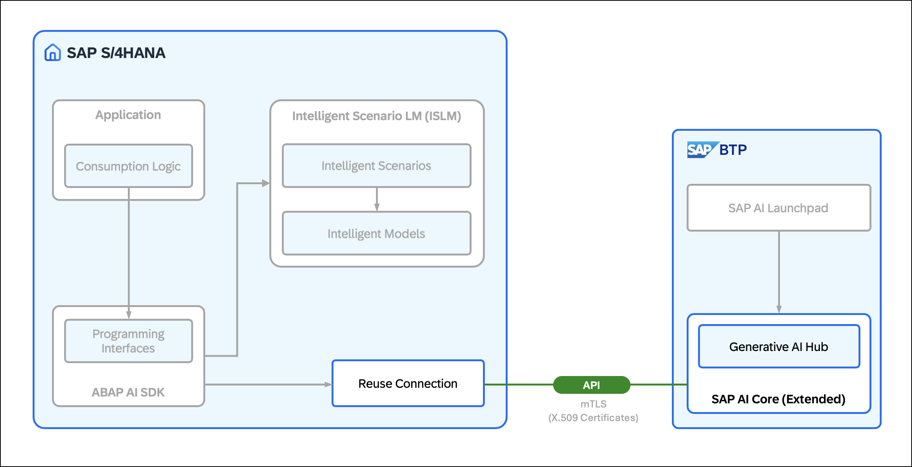

**Further Information**:

- Learn more about Intelligent Scenario Lifecycle Management (ISLM) on SAP Help Portal: [Intelligent Scenario Lifecycle Management](https://help.sap.com/docs/ABAP_PLATFORM_NEW/7989a582039547ae91d8f483e487058d/436151b128614f0e84024015136043d3.html?version=latest)
- Explore additional resources in the SAP Community: [Intelligent Scenario Lifecycle Management for SAP S/4HANA](https://pages.community.sap.com/topics/intelligent-scenario-lifecycle-management-s4hana)
- Review supported certificate authorities for mTLS: [Trusted Authorities for X.509 Certificates](https://help.sap.com/docs/btp/sap-business-technology-platform/trusted-certificate-authorities-for-x-509-secrets?version=Cloud)


### Generate a Client Certificate in SAP BTP
In this step, you create a client certificate in SAP BTP to enable secure communication using mutual TLS (mTLS). This demonstrates a generic approach, but you can also use your own PKI if the certificate is issued by a supported certificate authority.

1\. Log on to your **SAP BTP subaccount** and open **Connectivity** &gt; **Destination Certificates**.

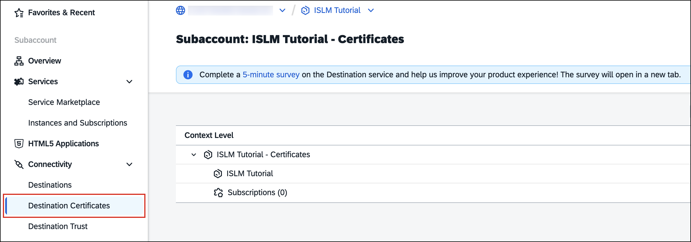

2\. Choose **Create**.

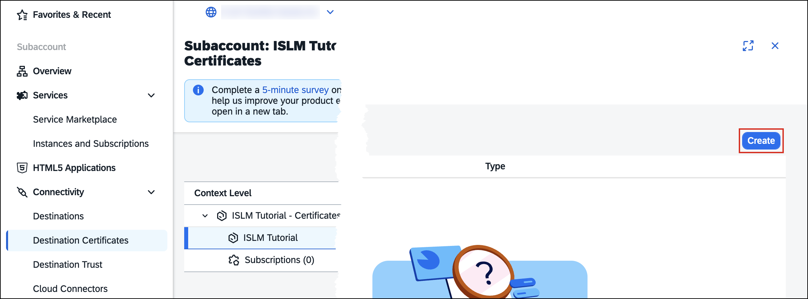

3\. In the **Create Certificate** dialog, maintain the following values:

- **Generation Method**: `External service`
- **Name**: Enter a name, for example `DEV`
- **File Extension**: `PEM`
- **Common Name (CN)**: Use the same value as for the Name field, for example `DEV`
- **Validity**: Select a validity period, for example `1 year`
- **Password**: Enter a password for the certificate
- **Automatic Renewal**: `Enabled`

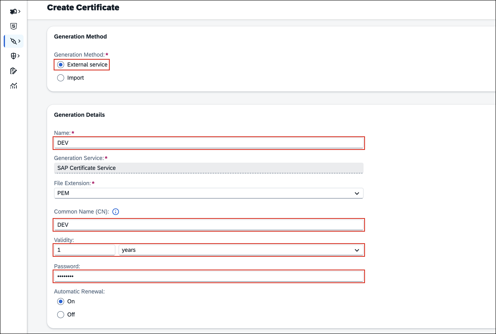

4\. Choose **Create**.

5\. After a few seconds, the **certificate** is created and available for download.

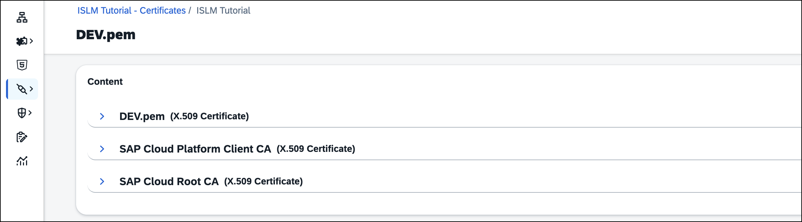

6\. Congratulations! You have successfully created the client certificate.


### Create a Destination Service Instance for API Access
In this step, you create a Destination service instance in SAP BTP and generate a service binding to retrieve the credentials required for API access. Since the private key of the client certificate is not available for download in the SAP BTP cockpit, you use the Destination Service REST API to download the full certificate.

1\. Log on to your **SAP BTP subaccount** and open **Services** &gt; **Instances and Subscriptions**.

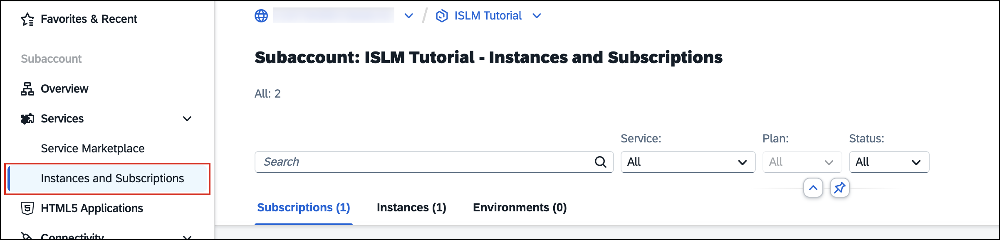

2\. Choose **Create**.

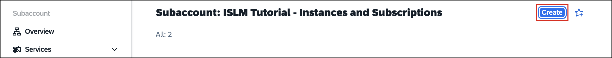

3\. In the **New Instance or Subscription** dialog, maintain the following values:

- **Service**: `Destination Service`
- **Plan**: `lite`
- **Runtime Environment**: `Other`
- **Instance Name**: Enter a name, for example `destination-instance`

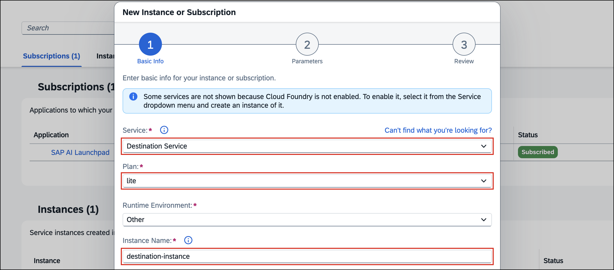    

4\. Choose **Create**.

5\. After a few seconds, the service instance is created successfully.

6\. Choose **...** &gt; **Create Service Binding**.

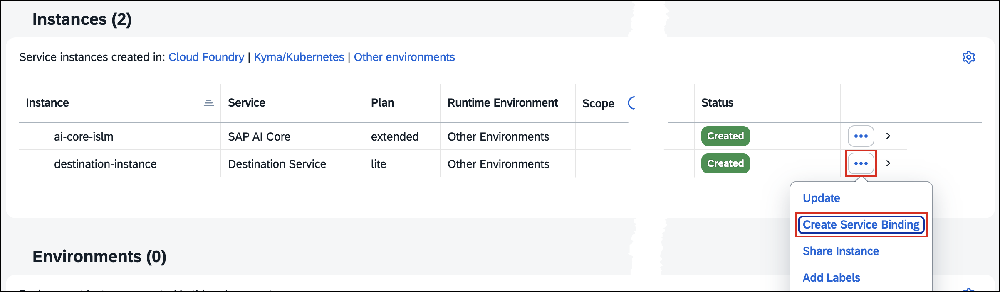 

7\. In the **New Binding** dialog, enter an **Binding Name**, for example `api-binding`, and choose **Create**.

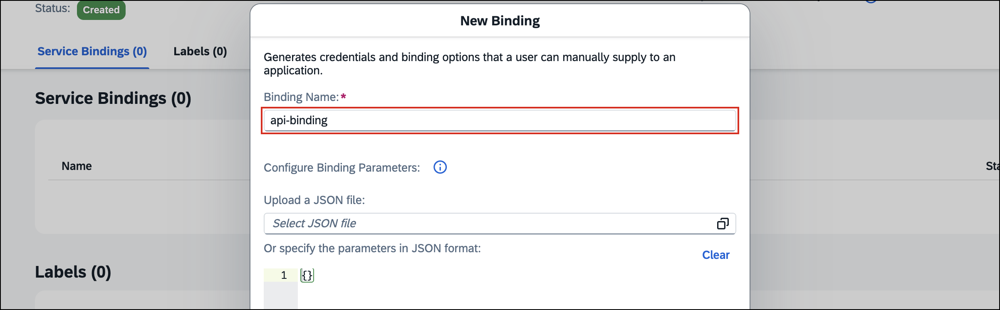 

8\. Open the created binding.

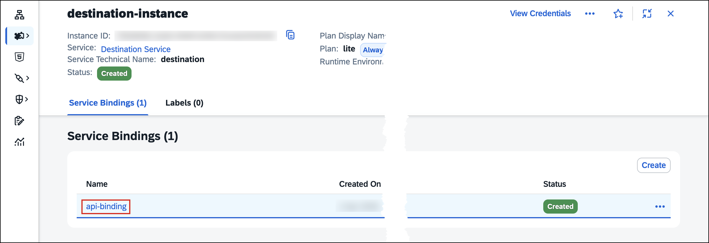 

9\. The credentials are displayed. Extract the values for `clientid`, `clientsecret`, `url` and `uri`.

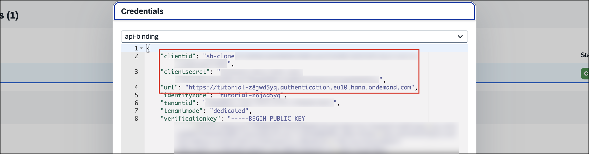 

10\. Congratulations! You have successfully created the destination service instance and binding.


### Download the Client Certificate using the Destination Service API
In this step, you use the Destination Service REST API to download the client certificate along with its private key, and prepare it for use in SAP S/4HANA.

1\. Open **Bruno** (or Postman) and choose **Create Collection**.

> 💡 **TIP**: If you already created the collection in the previous tutorial, continue with step 3.

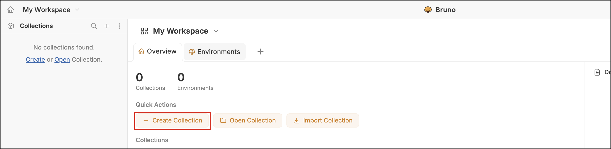 

2\. Enter a **Name** for the collection, for example `ISLM Tutorial` and choose **Create**.
     
 

3\. In the new collection, choose **...** next to the collection name and select **New Request**.
    
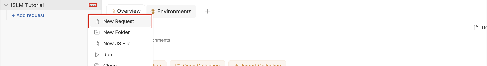

4\. In the **New Request** dialog, maintain the following values [1] and choose **Create** [2]:

- **Type**: `HTTP`
- **Name**: Enter a name, for example `Read Destination Certificate`
- **HTTP Method**: `GET`
- **URL**: Use the `uri` value from the service binding and append `/destination-configuration/v1/subaccountCertificates/<cert>`

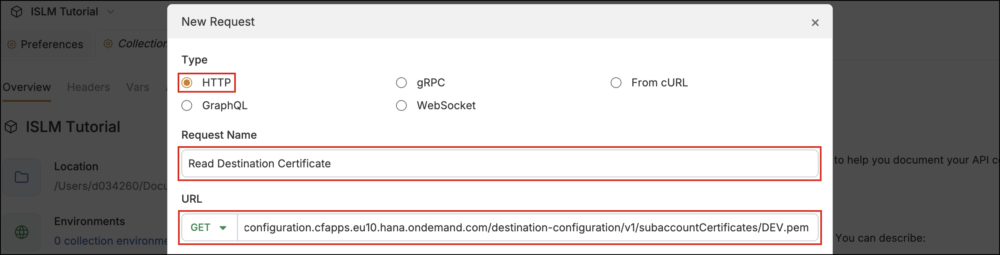

5\. In the **Request**, open the **Auth** tab and select **OAuth 2.0**.

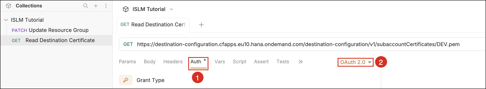

6\. Maintain the following OAuth 2.0 values:

- **Grant Type**: `Client Credentials`
- **Access Token URL**: Use the `url` value from the service binding and append `/oauth/token`
- **Client ID**: Enter the `clientid` value from the service binding
- **Client Secret**: Enter the `clientsecret` value from the service binding


7\. Choose **Get Access Token** [1]. After a few seconds, the token is fetched [2] and displayed. Choose **Save**.

> ℹ️ **NOTE**: The access token is used to authenticate when calling the SAP AI Core API.

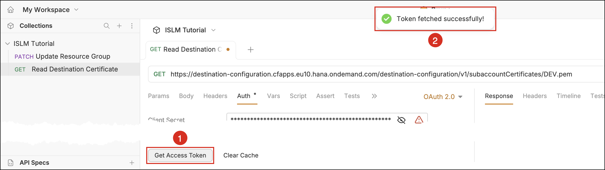

8\. Choose **Execute** to send the request.
    


9\. After a few milliseconds, the response is returned and displayed in the **Response** section. Copy the value of the **Content** field and paste it into a local text file, for example `client_certificate_base64.txt`.
    
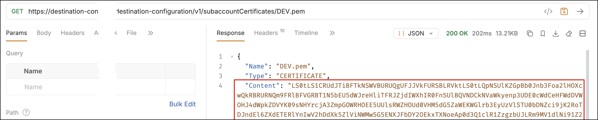

10\. Decode the Base64 content and save it as a PEM file, for example `client_certificate.pem`. You can use the following command:

**macOS (Terminal)**
```bash
base64 -d -i client_certificate_base64.txt -o client_certificate.pem
```

**Windows (PowerShell)**
```powershell
$base64 = Get-Content client_certificate_base64.txt
$bytes  = [System.Convert]::FromBase64String($base64)
Set-Content client_certificate.pem -Value $bytes -Encoding Byte
```
     
11\. Congratulations! You have successfully downloaded and prepared the client certificate for SAP S/4HANA.


### Import the Client Certificate into SAP S/4HANA
In this step, you create a new SSL client identity, import the client certificate into your SAP S/4HANA system, and assign it to the corresponding SSL client configuration for secure communication.

1\. Log on to your **SAP S/4HANA** system and open transaction **STRUST** (Trust Manager).

2\. Choose **Edit** [1] and navigate to **Environment** &gt; **SSL Client Identities of System** [2].
 
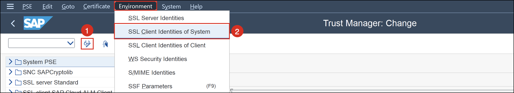

3\. Choose **Edit**, then choose **New Entries**.


4\. Enter an **Identity**, for example `ISLM`, and a **Description**, for example `ISLM Tutorial`. Choose **Save**.
 
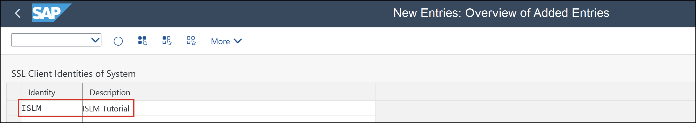

5\. When prompted, assign a transport request and choose **Continue**.

6\. Return to the **Trust Manager** screen and choose **PSE** &gt; **Import**.

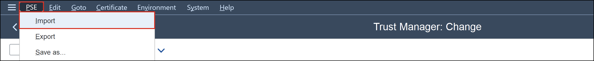

7\. Select the decoded certificate file (for example `client_certificate.pem`) and confirm the upload.

8\. Enter the password defined during certificate creation and choose **Continue**.

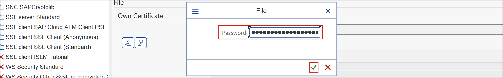

9\. After a few seconds, the certificate details are displayed. Choose **Import**.

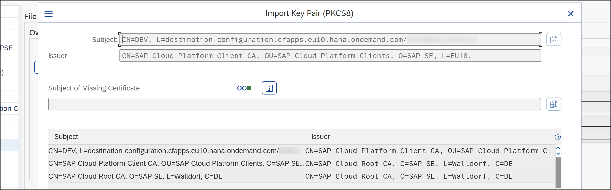

10\. Choose **PSE** &gt; **Save As**.

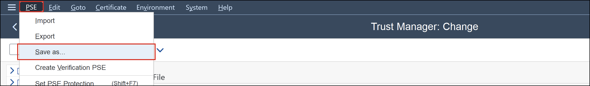

11\. In the **Save PSE As** dialog, select `SSL Client` and choose the newly created identity (for example `ISLM`). Confirm your selection.

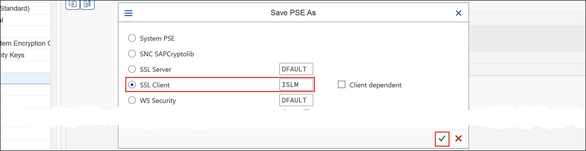

12\. Verify that the certificate is assigned to the selected **SSL Client PSE**. Then choose **Save**.

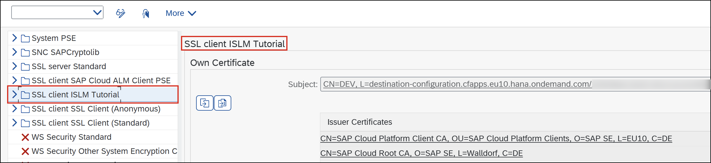

13\. Congratulations! You have successfully imported and assigned the client certificate to SAP S/4HANA.


### Export Public Certificate from ISLM Keystore for mTLS
In this step, you export the public certificate from your SAP S/4HANA keystore to use it in the service binding configuration to enable mTLS.

1\. Log on to your **SAP S/4HANA** system and open transaction **STRUST** (Trust Manager).

2\. Double-click the **SSL Client PSE** [1], for example `SSL client ISLM Tutorial`. Then double-click the **Subject** [2] field to open the certificate details.

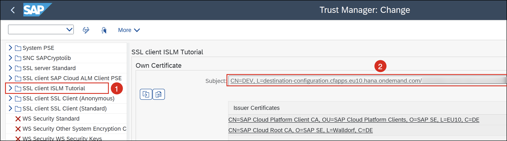

3\. Choose **Export certificate**.
 
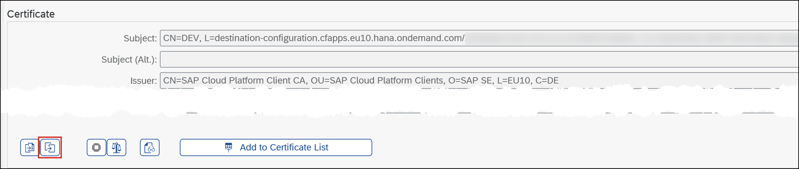

4\. In the **Export Certificate** dialog, enter a **file path**, for example `DEV.pem`, select `Base64` as the **file format**, and choose **Save**.
  
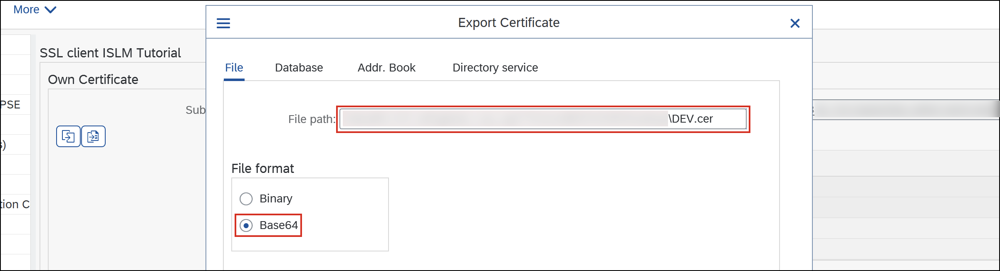

5\. Congratulations! You have successfully exported the public certificate for mTLS.


### Create an SAP AI Core Service Binding with mTLS Authentication
In this step, you create an additional SAP AI Core service binding for mTLS. You use the public certificate to establish trust and enable certificate-based authentication in the binding parameters.

1\. The **public certificate** extracted in the previous step must be converted into a single-line format before it can be used in the **service binding** configuration. Convert the certificate as follows:

**macOS (Terminal)**
```bash
tr -d '\r' < DEV.cer | sed 's/$/\\n/' | tr -d '\n'; echo
```

**Windows (PowerShell)**
```powershell
(Get-Content DEV.cer -Raw) -replace "`r?`n", "\n"
```

2\. Copy the resulting string. You will use it later in the binding payload.

3\. Log on to your **SAP BTP subaccount** and open **Services** &gt; **Instances and Subscriptions**.
    
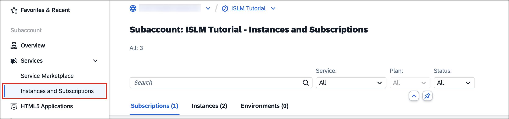

4\. For your existing **SAP AI Core** service instance, choose **...** &gt; **Create Service Binding**.
    
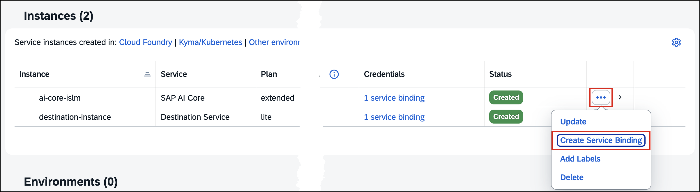

5\. In the **New Binding** dialog, enter an **Instance Name**, for example `api-binding-mtls`.

6\. Specify the following JSON in the **Configure Binding Parameters** section. Replace `<paste your converted public certificate here>` with the converted certificate string from step 1:
    
```json
{
  "xsuaa": {
  	"credential-type": "x509",
    "x509": {
      "certificate": "<paste your converted public certificate here>",
      "ensure-uniqueness": false,
      "certificate-pinning": false,
      "hide-certificate": true
    }
  }
}
```

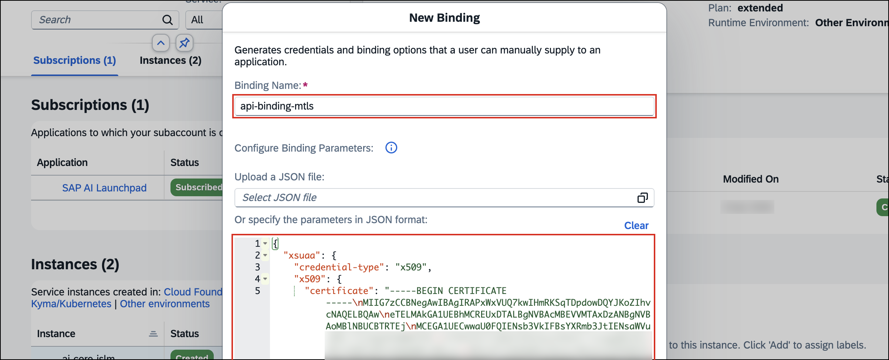

7\. Choose **Create**.

8\. Open the created binding.
     
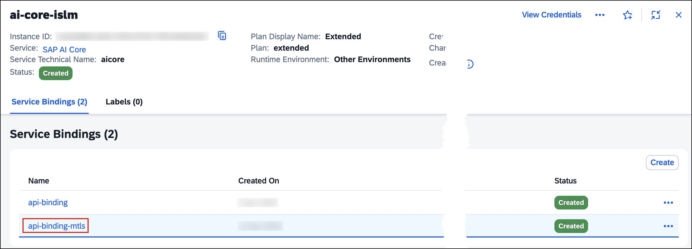

9\. Choose **Download** to store the service binding credentials.
    
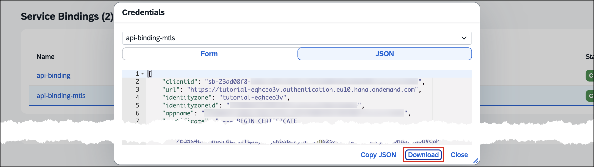

10\. Congratulations! You have successfully created the SAP AI Core service binding for mTLS.


### Import the Root CA Certificate into the Trust Store
In this step, you import the Root CA certificate into your SAP S/4HANA trust store to establish trust with the SAP BTP endpoint used for mTLS authentication and token requests.

1\. Open the [DigiCert](https://cacerts.digicert.com/DigiCertGlobalRootG2.crt) URL in a browser and download the Root CA certificate.

2\. Log on to your **SAP S/4HANA** system and open transaction **STRUST** (Trust Manager).

3\. Choose **Edit** [1] and open the SSL Client PSE [2], for example `SSL client ISLM Tutorial`.
 
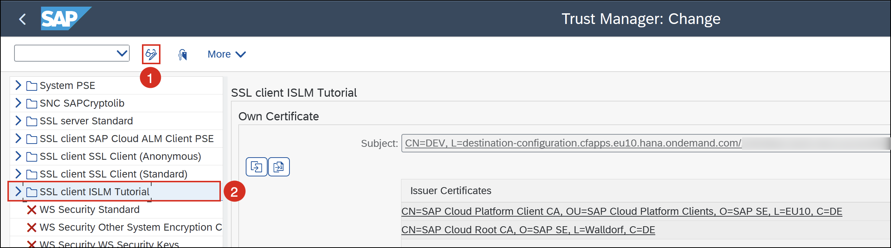

4\. Scroll down to the **Certificate** section and choose **Import certificate**.
 
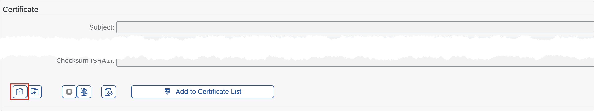

5\. Select the certificate file and confirm the upload.

6\. Choose **Add to Certificate List**.

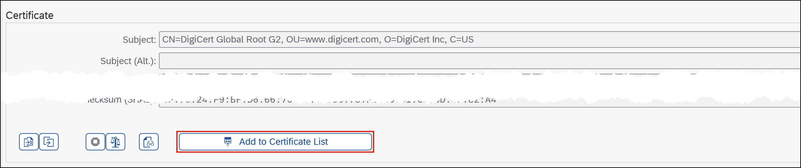

7\. Verify that the Root CA certificate appears in the certificate list.

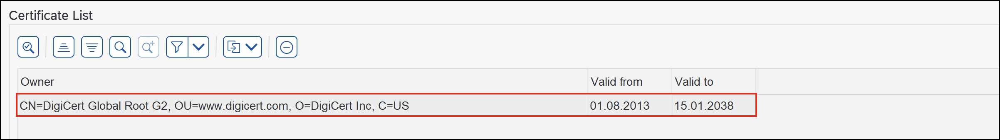

8\. Congratulations! You have successfully imported the Root CA Certificate into the trust store.


### Create an OAuth 2.0 Client for mTLS Authentication
In this step, you create an OAuth 2.0 client configured for mTLS authentication to securely obtain tokens from SAP AI Core.

1\. Log on to your **SAP S/4HANA** system and open transaction **OA2C_CONFIG** (OAuth 2.0 Clients).

2\. The OAuth 2.0 Clients application opens in a browser. Choose **Create**.

> 💡 **TIP**: If you receive a **Forbidden error**, activate the **oa2c_config** service in transaction SICF.

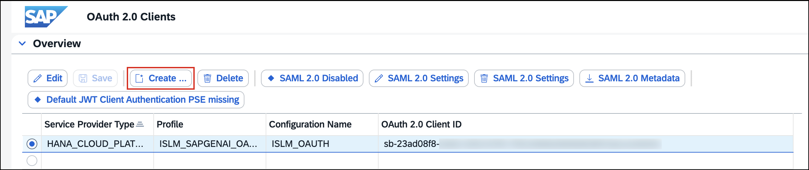

3\. In the **Create a new OAuth 2.0 client** dialog, maintain the following values and choose **OK**:

- **OAuth 2.0 Client Profile**: `ISLM_SAPGENAI_OAUTH_PRF_HCP`
- **Configuration Name**: Enter a name, for example `ISLM_OAUTH_MTLS`
- **OAuth 2.0 Client ID**: Enter the `clientid` value from the service binding

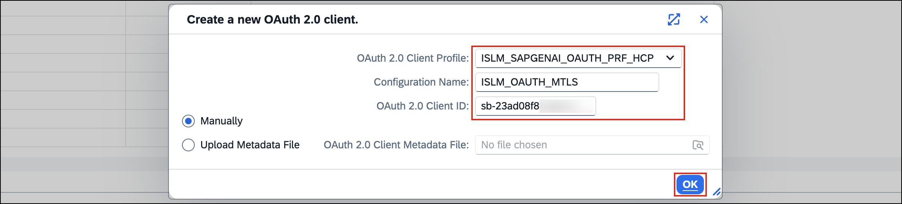

4\. After confirming, the **OAuth 2.0 client** is created and you are redirected to the details screen. Maintain the following values:

- **Token Endpoint**: Use the `url` value from the service binding, remove the protocol, and append `/oauth/token`
- **Client Authentication**: `Client Certificate`
- **Selected Grant Type**: `Client Credentials`
- **SSL Client PSE**: Select the SSL Client PSE, for example `ISLM ISLM Tutorial`
- **mTLS Token Endpoint Alias**: Use the `certurl` value from the service binding, remove the protocol, and append `/oauth/token`

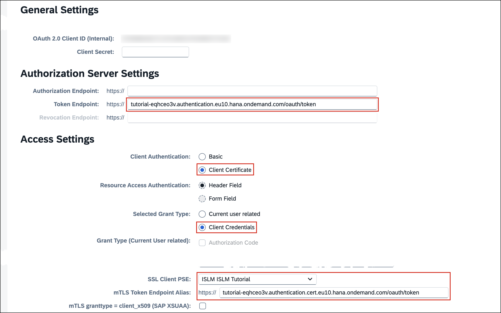

5\. Choose **Save**.

> ℹ️ **NOTE**: The selected **SSL Client PSE** is used for mTLS authentication. It provides the client certificate for authentication and contains the trusted CA certificate required to establish trust with the certificate endpoint (`certurl`).

6\. Congratulations! You have successfully created the OAuth 2.0 client for ISLM.


### Update the Destination with the New OAuth Client
In this step, you update the existing HTTP destination in your SAP S/4HANA system to use the OAuth client configured for mTLS authentication. This ensures that communication with SAP AI Core is secured using certificate-based authentication.

1\. Log on to your **SAP S/4HANA** system and open transaction **SM59** (Configuration of RFC Destinations).

2\. Open your existing destination from the list, for example `ISLM_REUSE_CONNECTION`.

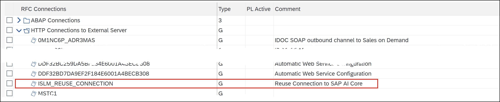

3\. Choose **Edit** [1].

4\. Navigate to **Logon & Security** [2] and choose **OAuth Settings** [3].
     
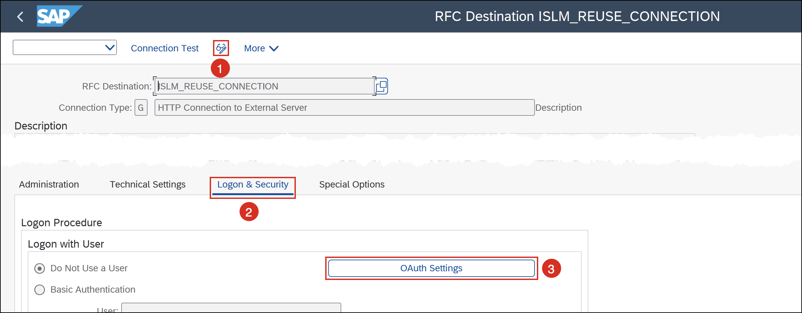

5\. In the **OAUTH Settings** dialog, select the OAuth client created in the previous step, for example `ISLM_OAUTH_MTLS` and choose **Save**.

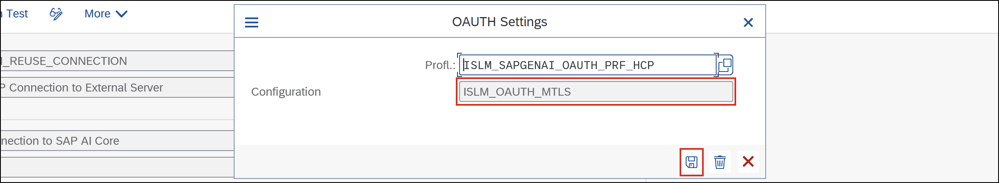
    
6\. Choose **Save** again.

> ℹ️ **NOTE**: The **SSL Client PSE** remains unchanged, as it already stores the certificate required to establish trust with the SAP AI Core endpoint.

7\. Congratulations! You have successfully updated the HTTP destination to use the mTLS-enabled OAuth client.


### Test the Usage Type for the Generative AI Scenario with mTLS
In this step, you test the assigned HTTP destination for the generative AI usage type in ISLM. This verifies that the configured mTLS-based connection is working correctly when used in ISLM.

1\. Log on to your **SAP S/4HANA** system and open transaction **ISLM_REUSE_CFGV** (Maintain Intelligent Scenario Usage).

2\. Select your existing entry [1] from the list and choose **Check Connection** [2] to verify the setup.

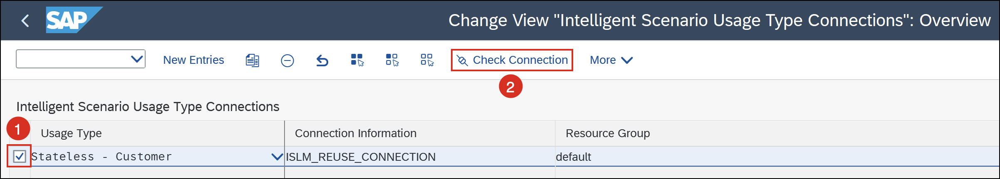

3\. The connection is successfully established and shows status READY. Verify that the updated **OAuth Config**, for example `ISLM_OAUTH_MTLS` is used.
 
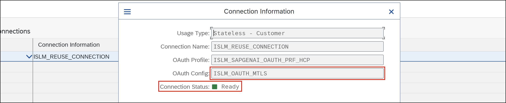

4\. Congratulations! You have successfully updated and verified the usage type for the generative AI scenario with mTLS.


### Test yourself
Test your understanding of the concepts covered in this tutorial. Select the correct answer and choose **Check Answer**.

---