# Set Up SAP BTP and Integrate SAP AI Core with ISLM
<!-- description --> Provision and configure SAP BTP services and integrate SAP AI Core with Intelligent Scenario Lifecycle Management (ISLM).

## Prerequisites
- You have access to an SAP BTP global account with administrative permissions
- You have SAP AI Core (plan: extended) and SAP AI Launchpad (plan: standard) entitlements available
- You have a basic understanding of SAP BTP services and related concepts such as service instances and bindings
- You have completed the tutorial [Configure Your SAP S/4HANA System for ISLM](abap-islm-setup-prepare)

## You will learn
- Create SAP AI Core and SAP AI Launchpad services and subscriptions in SAP BTP
- Connect SAP S/4HANA to SAP AI Core and configure a reusable connection

---

### Overview
In this tutorial, you connect your **SAP S/4HANA** system to **SAP BTP** and enable **Intelligent Scenario Lifecycle Management** (ISLM) to communicate with **SAP AI Core**. You provision the required SAP BTP services, configure OAuth 2.0 authentication, and establish the communication from **SAP S/4HANA** to **SAP AI Core**. This enables ISLM to execute custom generative AI scenarios using **SAP AI Core**.

For learning purposes, the required services are set up manually in this tutorial. You can also use the available boosters and only complete the additional steps described in this tutorial.

The diagram illustrates how ISLM is embedded in the overall architecture and how it connects to SAP AI Core. This tutorial focuses on the SAP S/4HANA and SAP BTP components highlighted in the diagram.

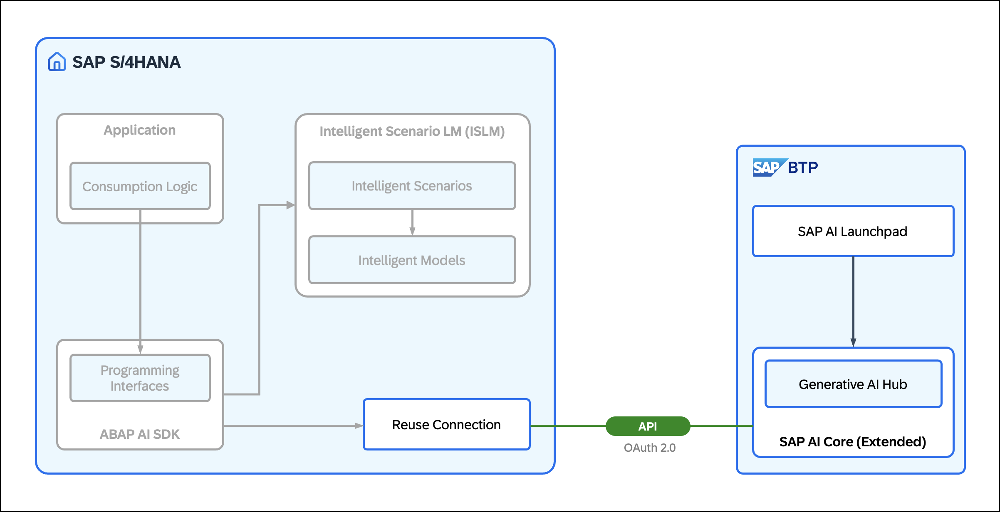

**Further Information**:

- Learn more about Intelligent Scenario Lifecycle Management (ISLM) on SAP Help Portal: [Intelligent Scenario Lifecycle Management](https://help.sap.com/docs/ABAP_PLATFORM_NEW/7989a582039547ae91d8f483e487058d/436151b128614f0e84024015136043d3.html?version=latest)
- Explore additional resources in the SAP Community: [Intelligent Scenario Lifecycle Management for SAP S/4HANA](https://pages.community.sap.com/topics/intelligent-scenario-lifecycle-management-s4hana)


### Add Entitlements to the SAP BTP Subaccount
In this step, you assign the required entitlements in your SAP BTP subaccount for SAP AI Core and SAP AI Launchpad.

1\. Log on to your **SAP BTP subaccount** (or create a new one) and open **Entitlements**.
     
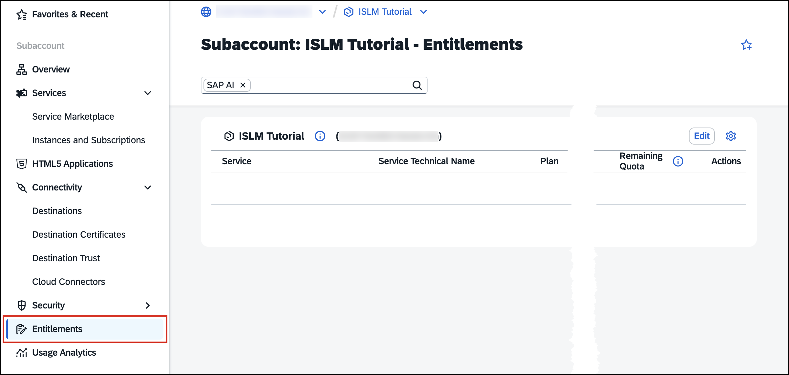

2\. Choose **Edit**.

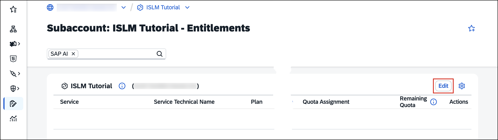

3\. Choose **Add Service Plans**.

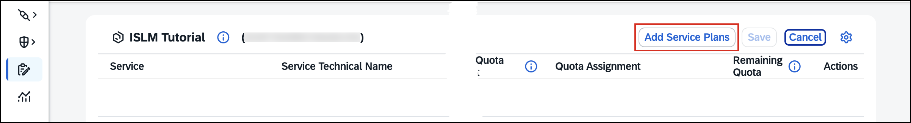

4\. In the **Add Service Plans** dialog, select **SAP AI Core** [1] and enable the **extended** [2] service plan.
     
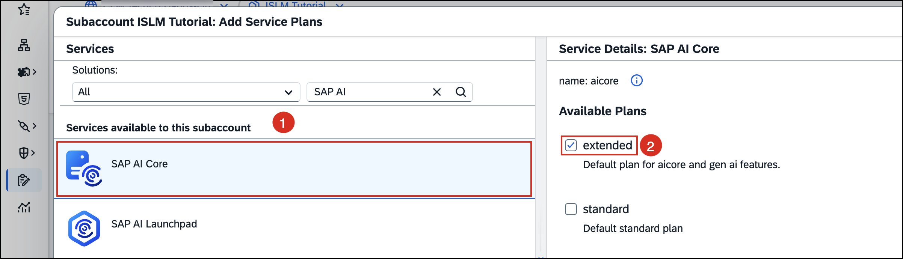

5\. In addition, select **SAP AI Launchpad** [1] and enable the **standard (Application)** [2] service plan. Then choose **Add 2 Service Plans**.

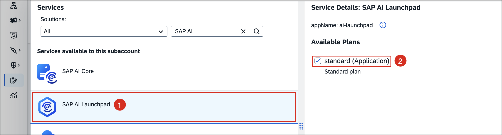

6\. Choose **Save**.
     
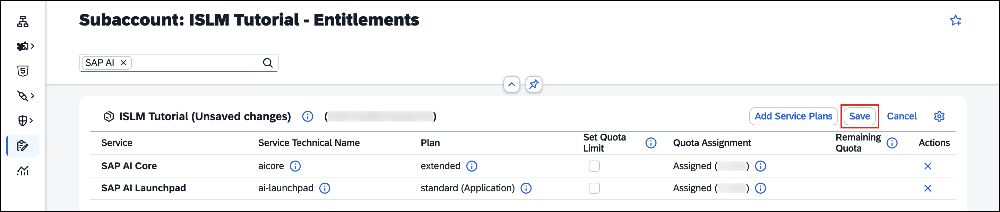

7\. Congratulations! You have now successfully assigned the required entitlements.


### Create an SAP AI Core Service Instance
In this step, you create an SAP AI Core service instance and binding. The binding provides the credentials required to connect your SAP S/4HANA system.

1\. Log on to your **SAP BTP subaccount** and open **Services** &gt; **Instances and Subscriptions**.

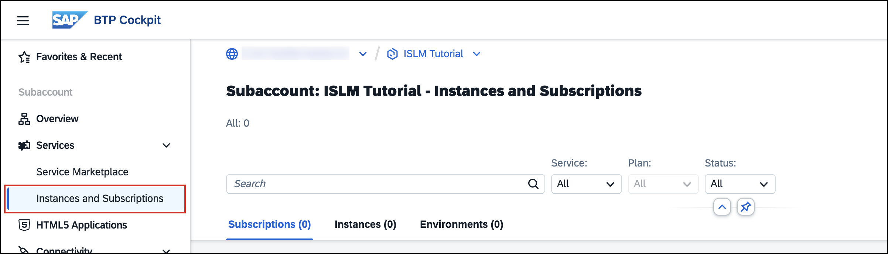

2\. Choose **Create**.


3\. In the **New Instance or Subscription** dialog, maintain the following values:

- **Service**: `SAP AI Core`
- **Plan**: `extended`
- **Runtime Environment**: `Other`
- **Instance Name**: Enter a name, for example `ai-core-islm`

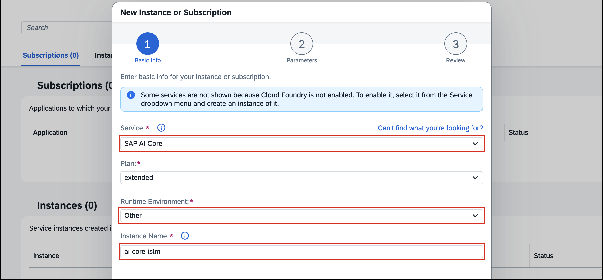

4\. Choose **Create**.

5\. After a few seconds, the service instance is created successfully.

6\. For the created service instance, choose **...** &gt; **Create Service Binding**.

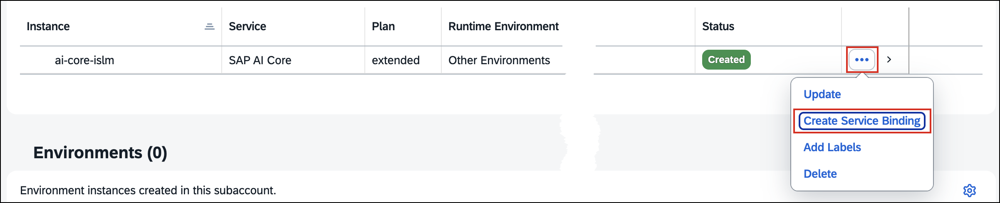

7\. In the **New Binding** dialog, enter a **Instance Name**, for example `api-binding`, and choose **Create**.

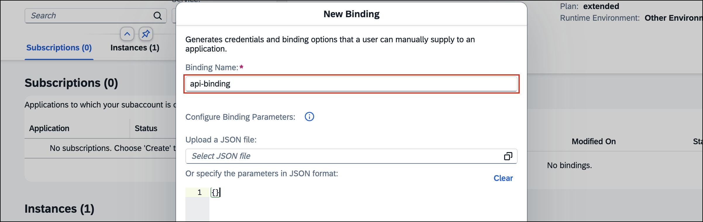

8\. Open the created binding.

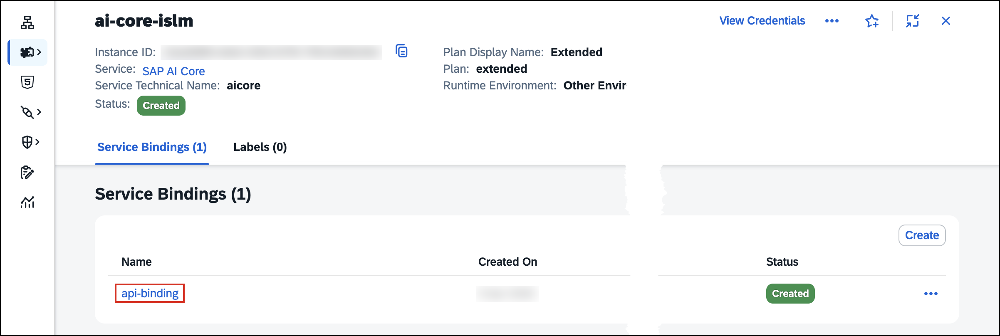

9\. Choose **Download** to save the service binding credentials (JSON file).

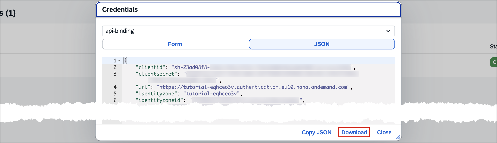

10\. Congratulations! You have successfully created the SAP AI Core service instance and binding.


### Subscribe to SAP AI Launchpad
In this step, you subscribe to SAP AI Launchpad and assign the required role collections to your user to access the application.

1\. Log on to your **SAP BTP subaccount** and open **Services** &gt; **Instances and Subscriptions**.

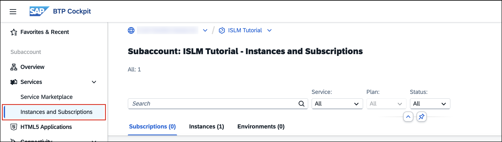

2\. Choose **Create**.
     
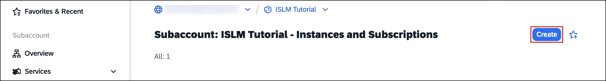

3\. In the **New Instance or Subscription** dialog, maintain the following values:

- **Service**: `SAP AI Launchpad`
- **Plan**: `standard`

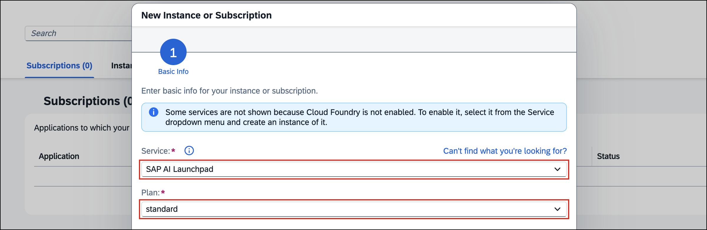

4\. Choose **Create**.

5\. After a few seconds, the application is subscribed successfully.

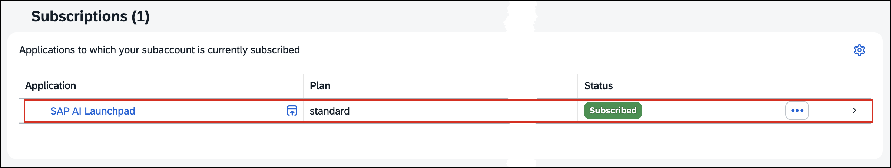

6\. In the **SAP BTP Cockpit**, navigate to **Security** &gt; **Users** [1] and open your user [2].

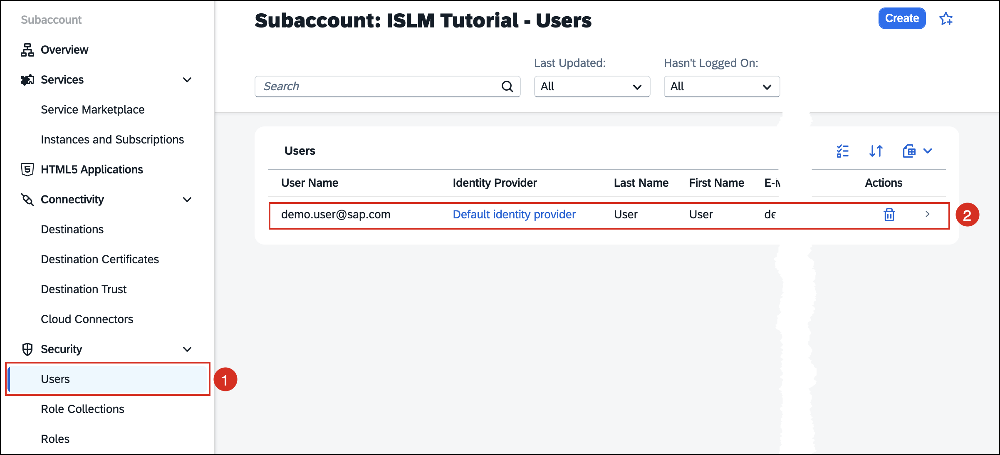

7\. Choose **Assign Role Collection**.

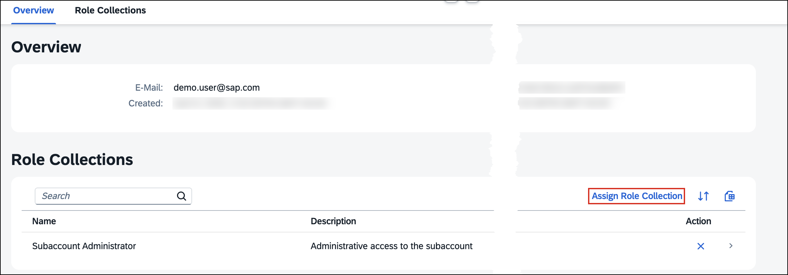

8\. In the **Assign Role Collection** dialog, select the following role collections and confirm:

- `ailaunchpad_aicore_admin_editor`
- `ailaunchpad_allow_all_resourcegroups`
- `ailaunchpad_connections_editor`
- `ailaunchpad_genai_manager`
- `ailaunchpad_mloperations_editor`

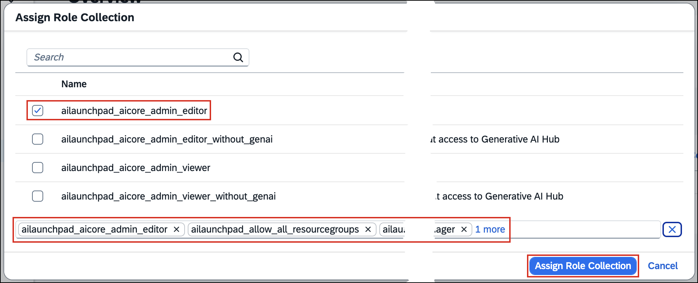

9\. Congratulations! You have now successfully subscribed to SAP AI Launchpad and assigned the required role collections.


### Verify SAP AI Launchpad Access
In this step, you verify that SAP AI Launchpad is correctly configured and connected to SAP AI Core. You create an AI API connection using the previously generated service binding and confirm that the setup is ready for use in ISLM scenarios.

1\. Log on to your **SAP BTP subaccount** and open **Services** &gt; **Instances and Subscriptions**.


2\. Open **SAP AI Launchpad** from the list of subscriptions.
     
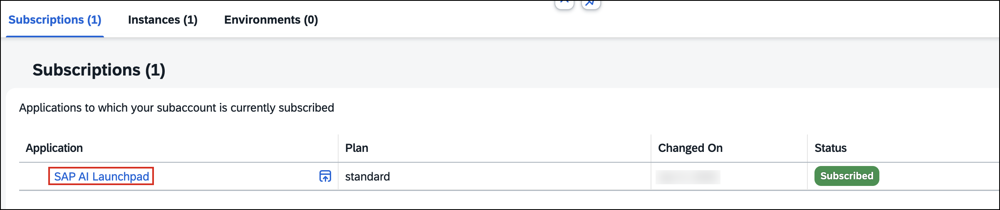

3\. In **SAP AI Launchpad**, navigate to **AI API Connections** and choose **Add**.
    
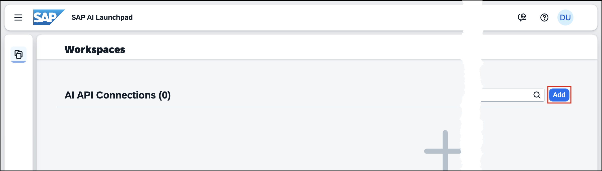

4\. In the **Create AI API Connection** dialog, maintain the following values and choose **Create**:

- **Connection Name**: Enter a name, for example `islm-tutorial`
- **Service Key**: Upload the service binding created previously, for example `api-binding.json`

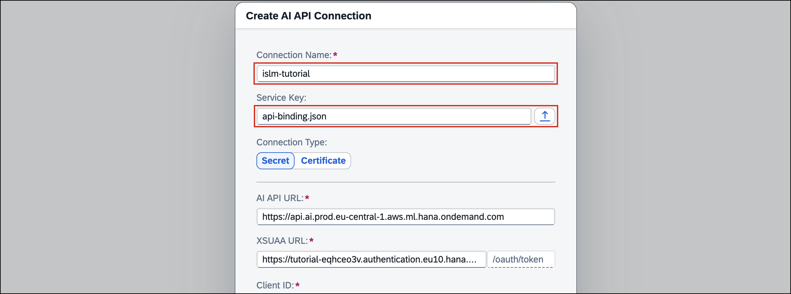

5\. After a few seconds, the connection is created and displayed.

> 💡 **TIP**: If **Document Grounding** is not enabled, continue with the next optional chapter to enable it via API.

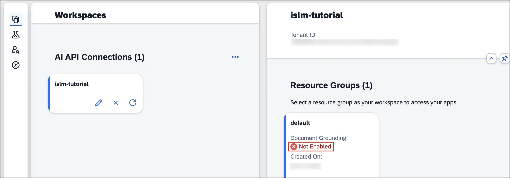

6\. The **AI API connection** is automatically selected and ready to use.
    
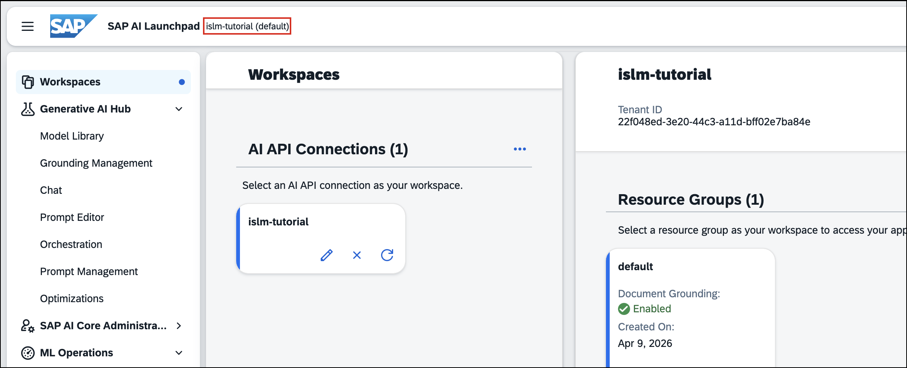

7\. Congratulations! You have now successfully verified SAP AI Launchpad access and confirmed that the integration is ready for your ISLM scenarios.


### Enable Document Grounding Using the API (Optional)
In this optional exercise, you enable Document Grounding for your SAP AI Core resource group using the API. This is only required if Document Grounding is not already enabled by default for your resource group.

1\. Open **Bruno** (or Postman) and choose **Create Collection**.


2\. Enter a **Name**, for example `ISLM Tutorial`, and choose **Create**.

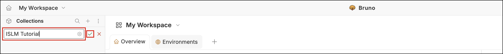

3\. In the new collection, choose **...** next to the collection name and select **New Request**.

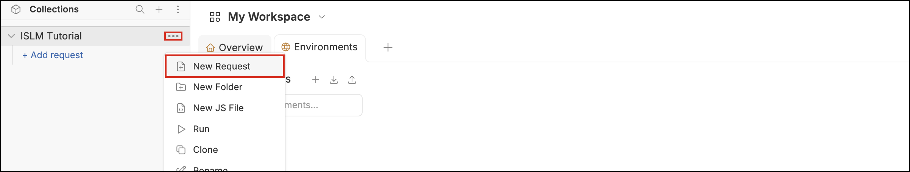

4\. In the **New Request** dialog, maintain the following values [1] and choose **Create** [2]:

- **Type**: `HTTP`
- **Name**: Enter a name, for example `Update Resource Group`
- **HTTP Method**: `PATCH`
- **URL**: Use the `AI_API_URL` from the service binding and append `/v2/admin/resourceGroups/default`

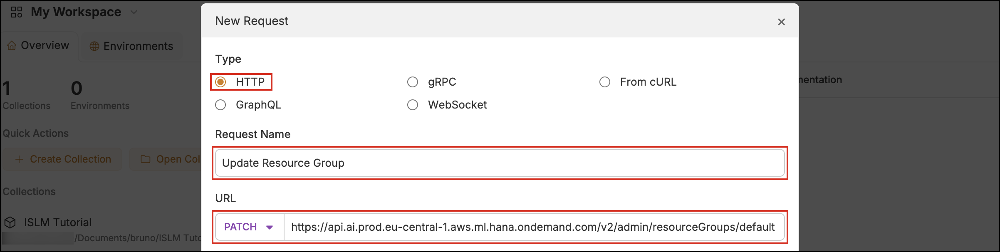

5\. In the **Request**, open the **Auth** tab and select **OAuth 2.0**.
 
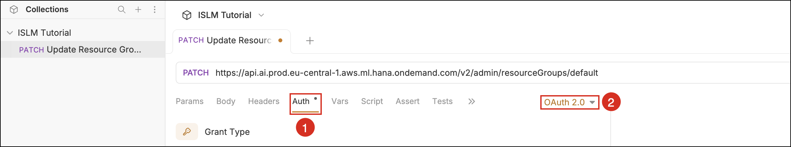

6\. Maintain the following OAuth 2.0 values:

- **Grant Type**: `Client Credentials`
- **Access Token URL**: Use the `url` value from the service binding and append `/oauth/token`
- **Client ID**: Enter the `clientid` value from the service binding
- **Client Secret**: Enter the `clientsecret` value from the service binding


7\. Choose **Get Access Token** [1]. After a few seconds, the token is retrieved [2] and displayed. Choose **Save**.

> ℹ️ **NOTE**: The access token is used to authenticate when calling the SAP AI Core API.

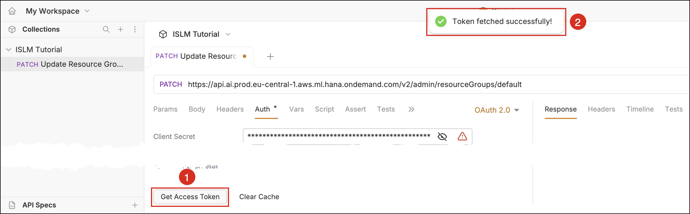

8\. Open the **Body** [1] tab and select **JSON** [2].  Enter the following JSON payload [3]:
     
```json
	{
		"labels": [
    	{
      	"key": "ext.ai.sap.com/document-grounding",
        "value": "true"
      }
    ]
  }
```
    
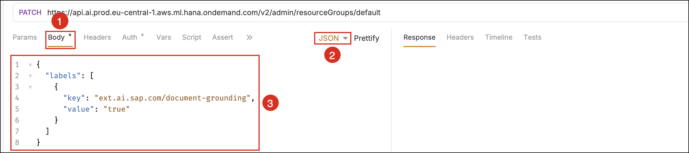

9\. Choose **Execute**.

10\. Log on to your **SAP BTP subaccount** and open **Services** &gt; **Instances and Subscriptions**.

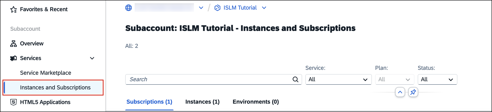

11\. Open **SAP AI Launchpad** from the list of subscriptions.
 


12\. Document Grounding is now enabled for the default resource group.
  
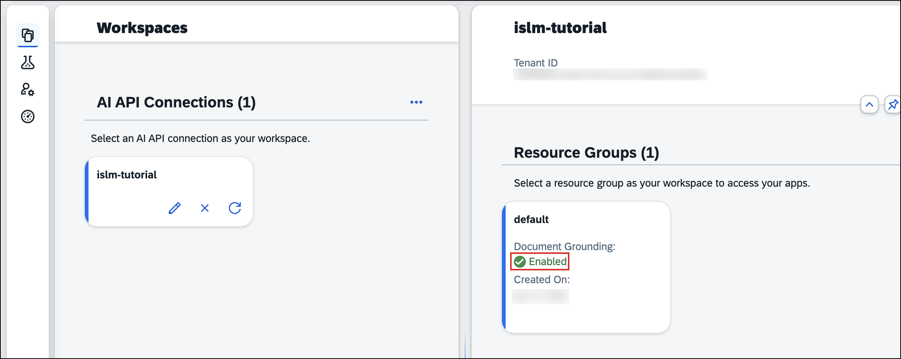

13\. Congratulations! You have successfully enabled Document Grounding for the default resource group. 


### Import the Root CA Certificate into the Trust Store
In this step, you import the Root CA certificate of SAP AI Core into the trust store of your SAP S/4HANA system. This ensures that secure HTTPS communication with SAP AI Core can be established.

1\. From the **SAP AI Core** service binding, copy the `AI_API_URL`.

2\. Open the URL in a browser and display the certificate details.

3\. In the **Certificate Viewer**, switch to the **Details** tab, select the root certificate [1], and choose **Export** [2].

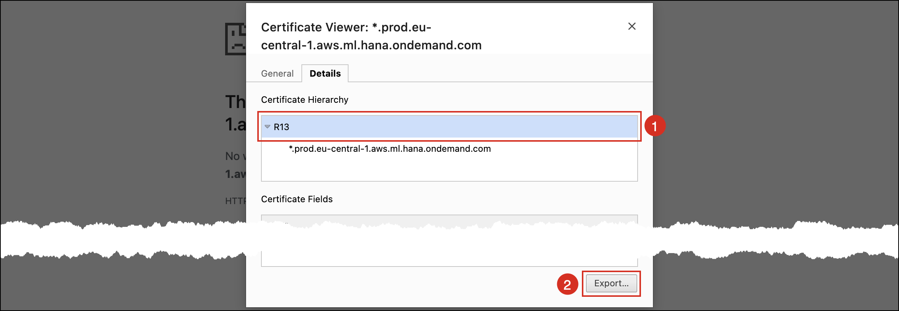

4\. Save the certificate locally.

5\. Log on to your **SAP S/4HANA** system and open transaction **STRUST** (Trust Manager).

6\. Choose **Edit** [1] and open the **SSL client SSL Client (Standard)** PSE [2].

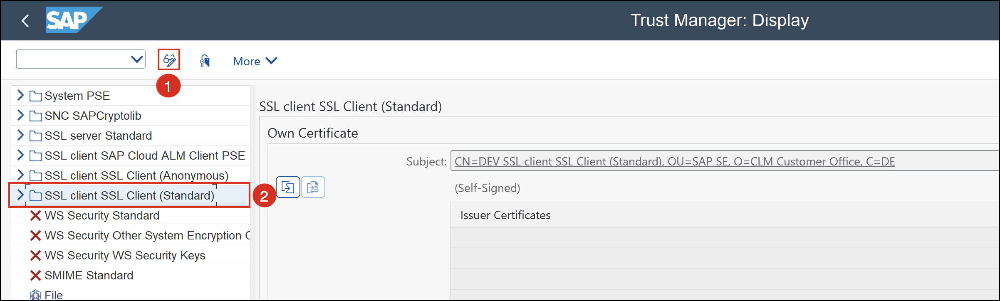

7\. In the **Certificate** section, choose **Import certificate**.
 
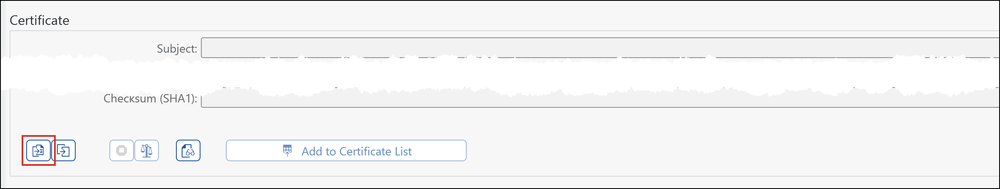

8\. Select the certificate file and confirm the upload.

9\. Choose **Add to Certificate List**.
 
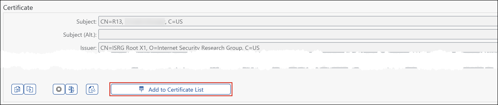

10\. Verify that the Root CA certificate appears in the certificate list.

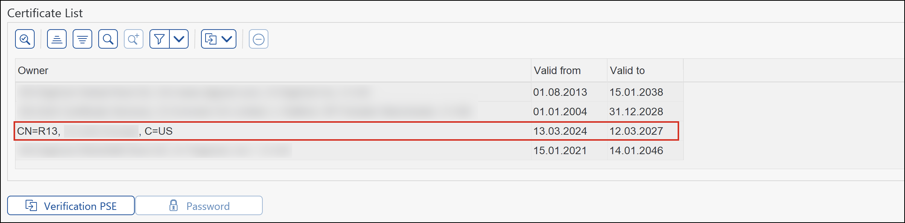

11\. Congratulations! You have successfully imported the Root CA Certificate into the trust store.


### Create an OAuth 2.0 Client in SAP S/4HANA
In this step, you create an OAuth 2.0 client in your SAP S/4HANA system. This client is used to authenticate requests from ISLM to SAP AI Core using the OAuth 2.0 client credentials flow.

1\. Log on to your **SAP S/4HANA** system and open transaction **OA2C_CONFIG** (OAuth 2.0 Clients).

2\. The OAuth 2.0 Clients application opens in a browser. Choose **Create**.

> 💡 **TIP**: If you receive a **Forbidden error**, activate the `oa2c_config` service in transaction SICF.

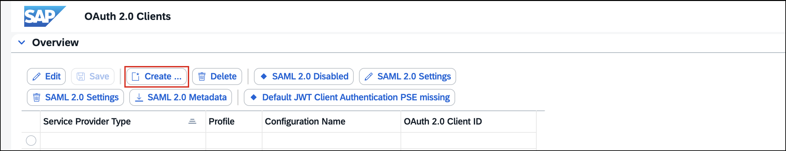

3\. In the **Create a new OAuth 2.0 client** dialog, maintain the following values and choose **OK**:

- **OAuth 2.0 Client Profile**: `ISLM_SAPGENAI_OAUTH_PRF_HCP`
- **Configuration Name**: Enter a name, for example `ISLM_OAUTH`
- **OAuth 2.0 Client ID**: Enter the `clientid` value from the service binding


4\. After confirming, the **OAuth 2.0 client** is created and you are redirected to the details screen. Maintain the following values:

- **Client Secret**: Enter the `clientsecret` value from the service binding
- **Token Endpoint**: Use the `url` value from the service binding, remove the protocol, and append `/oauth/token`
- **Client Authentication**: `Basic`
- **Selected Grant Type**: `Client Credentials`
- **SSL Client PSE**: `DEFAULT SSL Client (Standard)`

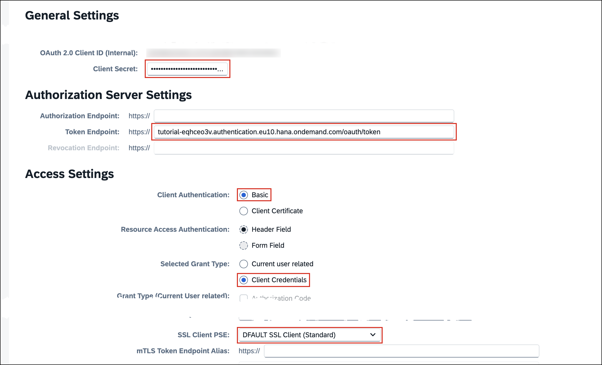

5\. Choose **Save**.

6\. Congratulations! You have successfully created the OAuth 2.0 client for ISLM.


### Create an HTTP Destination to SAP AI Core
In this step, you create an HTTP destination in your SAP S/4HANA system to enable communication with SAP AI Core. This destination is used by ISLM to call the SAP AI Core API.

1\. Log on to your **SAP S/4HANA** system and open transaction **SM59** (Configuration of RFC Destinations).

2\. Choose **Create**.

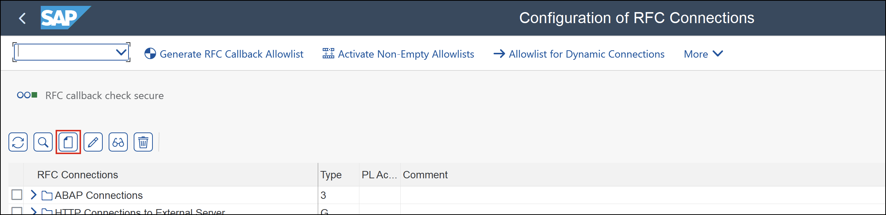

3\. In the **Create Destination** dialog, maintain the following values [1] and choose **Continue** [2]:

- **Destination**: Enter a name, for example `ISLM_REUSE_CONNECTION`
- **Connection Type**: `G` `HTTP connection to external server`

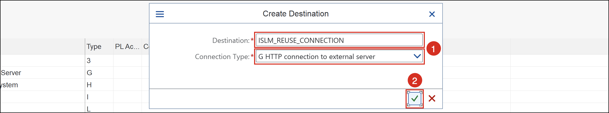

4\. After confirming, you are redirected to the **Technical Settings** tab. Maintain the following values:

- **Description 1**: Enter a description, for example `Reuse Connection to SAP AI Core`
- **Host**: Enter the `AI_API_URL` value from the service binding and remove the protocol
- **Post**: `443`
- **Path Prefix**: `/`

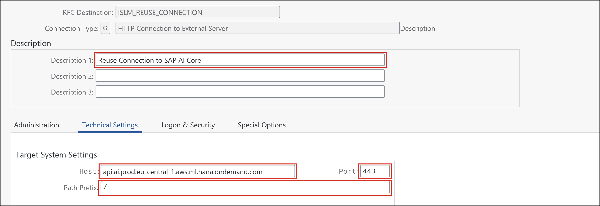

5\. Navigate to **Logon & Security** [1] and choose **OAuth Settings** [2].
 
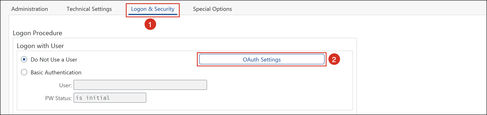

6\. In the **OAUTH Settings** dialog, select the OAuth client created in the previous step and choose **Save**.
  


7\. In the **Logon & Security** tab, scroll down to the **Security Options** and maintain the following values:

- **SSL**: `Active`
- **SSL Client PSE ID**: `DFAULT SSL Client (Standard)`

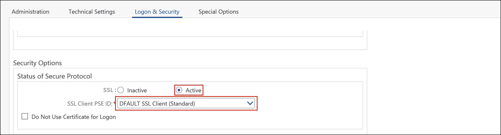

8\. Choose **Save**.

9\. Congratulations! You have successfully created the HTTP destination.


### Maintain the Usage Type for the Generative AI Scenario
In this step, you assign the HTTP destination to the generative AI usage type in ISLM. This enables ISLM to use the configured connection when executing generative AI scenarios.

1\. Log on to your **SAP S/4HANA** system and open transaction **ISLM_REUSE_CFGV** (Maintain Intelligent Scenario Usage).

2\. Choose **New Entries**.

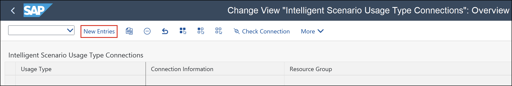

3\. In the **New Entries** dialog, maintain the following values:

- **Usage Type**: `Stateless - Customer`
- **Connection Information**: Select the HTTP Destination created in the previous step, for example `ISLM_REUSE_CONNECTION`
- **Resource Group**: `default`

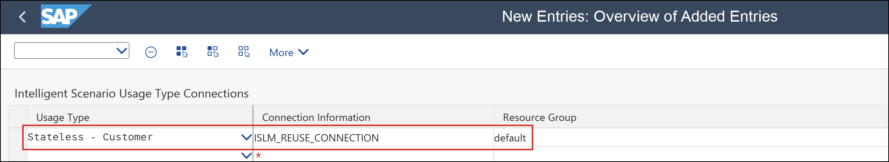

4\. Choose **Save** and return to the overview.

5\. Select the new entry [1] and choose **Check Connection** [2] to verify the setup.

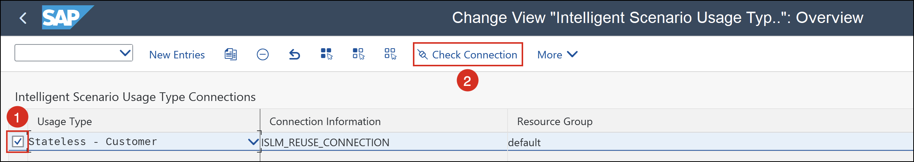

6\. The connection is successfully established and shows status **READY**.


> ℹ️ **NOTE**: You can now use ISLM to develop custom generative AI scenarios. It is recommended to continue with the next tutorial to enable mTLS-based authentication for communication with SAP AI Core.

7\. Congratulations! You have successfully configured the usage type for the generative AI scenario.


### Test yourself
Test your understanding of the concepts covered in this tutorial. Select the correct answer and choose **Check Answer**.

---