# Configure Your SAP S/4HANA System for ISLM
<!-- description --> Set up the ABAP AI SDK powered by Intelligent Scenario Lifecycle Management (ISLM) in your SAP S/4HANA system and enable custom generative AI scenarios.

## Prerequisites
- You have access to an SAP S/4HANA 2023 system (or higher) with SAP Fiori launchpad enabled
- You have the required authorizations to perform configuration tasks and access transactions such as SNOTE, STC01, SU01, and SBGRFCCONF
- You have access to SAP GUI and the SAP Fiori launchpad

## You will learn
- Set up Intelligent Scenario Lifecycle Management (ISLM) in SAP S/4HANA 2023 (or higher)
- Enable custom generative AI scenarios in your SAP S/4HANA system
- Configure bgRFC-based background processing for ISLM

---

### Overview
In this tutorial, you prepare your **SAP S/4HANA** system to enable **Intelligent Scenario Lifecycle Management** (ISLM) for custom generative AI scenarios. You implement the required SAP Notes, configure the necessary business roles, and enable background processing. This establishes the foundation for integrating SAP AI Core in the next tutorials.

The diagram illustrates how **Intelligent Scenario Lifecycle Management** is embedded in the overall architecture and how it connects to **SAP AI Core**. This tutorial focuses on the **SAP S/4HANA** components highlighted in the diagram.

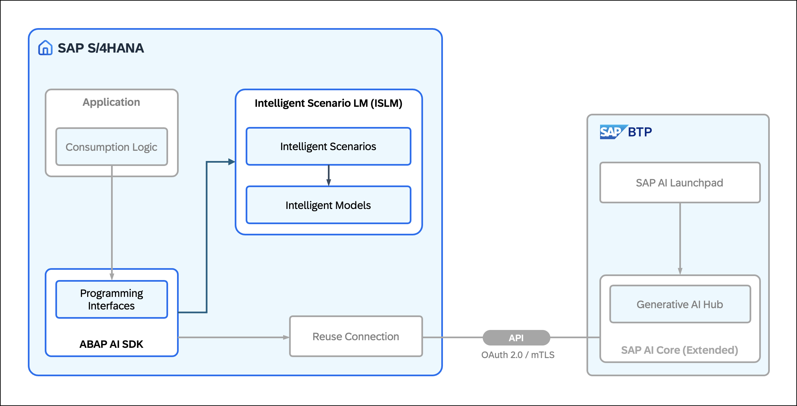

**Further Information**:

- Learn more about Intelligent Scenario Lifecycle Management (ISLM) on SAP Help Portal: [Intelligent Scenario Lifecycle Management](https://help.sap.com/docs/ABAP_PLATFORM_NEW/7989a582039547ae91d8f483e487058d/436151b128614f0e84024015136043d3.html?version=latest)
- Explore additional resources in the SAP Community: [Intelligent Scenario Lifecycle Management for SAP S/4HANA](https://pages.community.sap.com/topics/intelligent-scenario-lifecycle-management-s4hana)

### Implement Required SAP Notes
In this step, you implement the required SAP Notes and Transport-Based Correction Instructions** (TCIs) in your SAP S/4HANA system. SAP Notes contain correction instructions that adjust or enhance existing functionality in your system. During implementation, the system checks your release and identifies any prerequisite notes that must be processed first. This provides the technical foundation for custom generative AI scenarios with ISLM and enables integration with SAP AI Core.

1\. Log on to your **SAP S/4HANA** system and open transaction **SNOTE** (Note Assistant).

2\. Choose **Download SAP Note**.

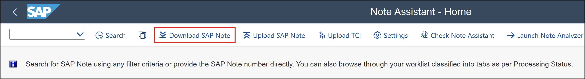

3\. In the **SAP Note Download** dialog, choose **Multiple Selection**.

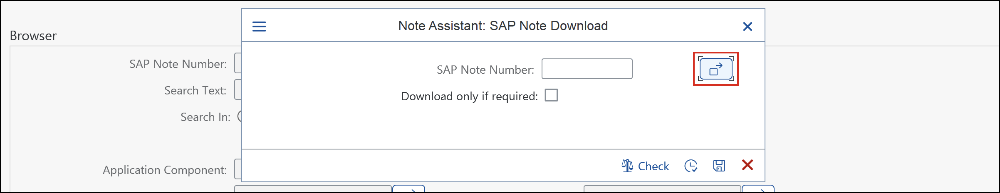

4\. Enter the following **SAP Notes** [1] and choose **Copy** [2]:

- [3513374](https://me.sap.com/notes/3513374)
- [3490653](https://me.sap.com/notes/3490653)
- [3668194](https://me.sap.com/notes/3668194)
- [3682148](https://me.sap.com/notes/3682148)
- [3700379](https://me.sap.com/notes/3700379)

> 💡 **TIP**: You can also copy all note numbers at once and paste them into the Multiple Selection dialog.

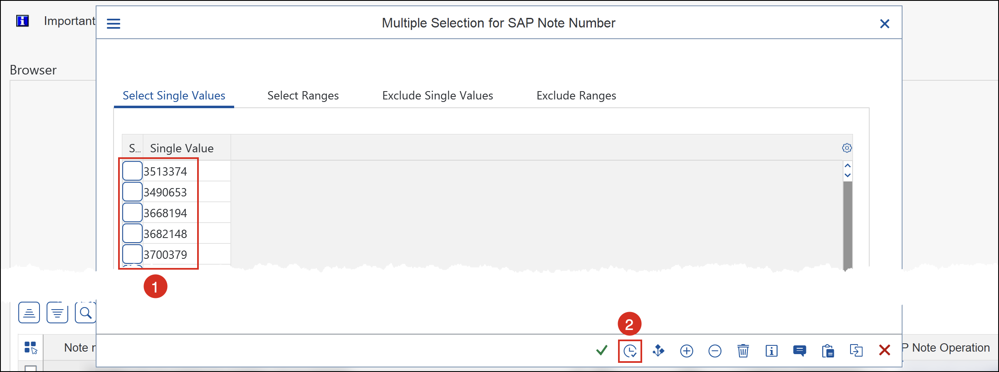

5\. Choose **Execute** to download the SAP Notes.

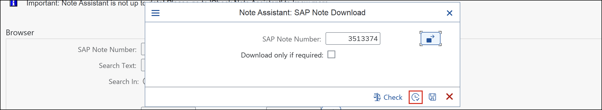

6\. The SAP Notes appear in the list. Depending on your **SAP S/4HANA** release, some **SAP Notes** might not be applicable.

> ℹ️ **NOTE**: In this example, some are already included in the standard and are therefore marked as **Cannot be implemented**.

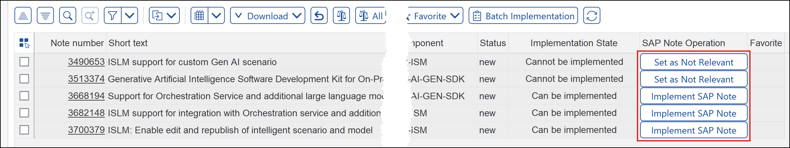

7\. If a note is delivered as a TCI, choose **Upload TCI** and upload the corresponding file ( **Note** &gt; **Correction Instructions** &gt; **Software Component Versions** &gt; **Download** ).

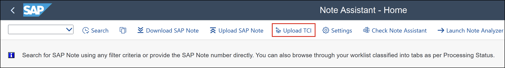

8\. For each SAP Note, choose one of the following:

- **Implement SAP Note**, if applicable
- **Set as Not Relevant**, if not required for your system

9\. Ensure that all relevant SAP Notes are successfully implemented and no errors occur.

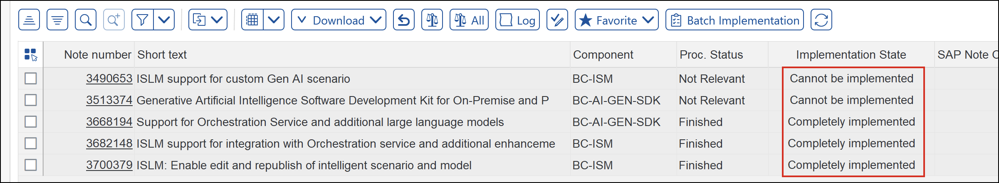

10\. Congratulations! You have successfully implemented the required SAP Notes and TCIs.

### Activate Business Role for Intelligent Scenarios
In this step, you activate and assign the required business role for Intelligent Scenario Lifecycle Management (ISLM) in your SAP S/4HANA system. You use the content activation task list to generate and activate the required business roles and SAP Fiori content. This enables access to the ISLM applications in the SAP Fiori launchpad.

1\. Log on to your **SAP S/4HANA** system and open transaction **STC01** (Task Manager for Technical Configuration).

2\. In the **Task List** field, enter `SAP_FIORI_CONTENT_ACTIVATION` and choose **Execute** (F8).

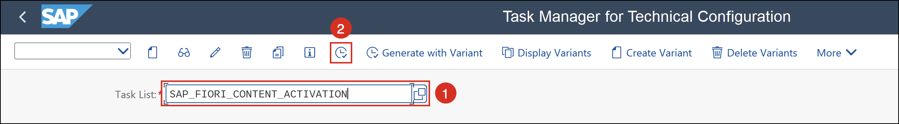

3\. Enable the task `Enter list of SAP Business Roles to be activated (optional)` [1], then choose **Fill Parameters** [2].

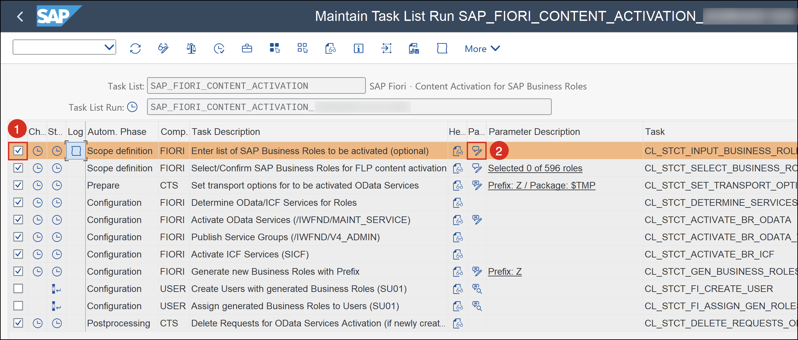

4\. In the **Define Business Roles** dialog, enter `SAP_BR_ANALYTICS_SPECIALIST` and choose **Continue**.

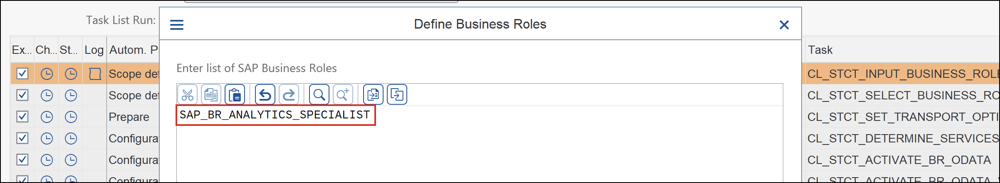

5\. Choose **Execute** (F8) to start the task list.

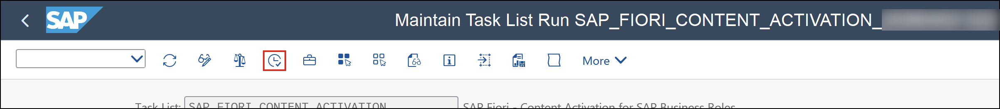

6\. Wait until the task list has completed successfully.

> 💡 **TIP**: Instead of the SAP standard role, you can also create your own business role tailored to your requirements.

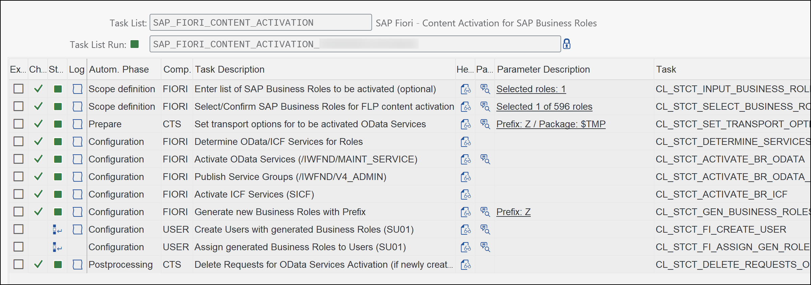

7\. Open transaction **SU01** (User Maintenance), enter your user [1], and choose **Change** [2].

> ℹ️ **NOTE**: The user **DEMO** is shown as an example. Replace it with your own user.

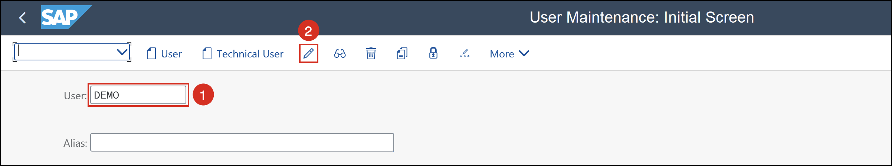

8\. Open the **Roles** tab and assign `Z_BR_ANALYTICS_SPECIALIST` to the user.

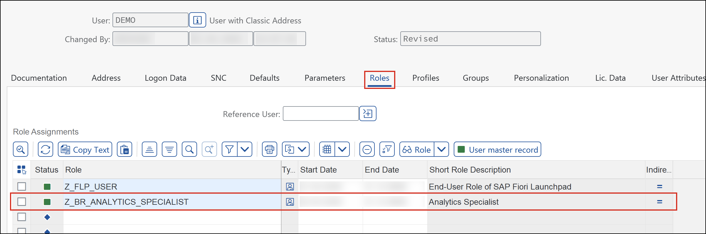

9\. Choose **Save**.

10\. Open the **SAP Fiori launchpad** (transaction: **/n/UI2/FLP**) and log on with your user.

11\. In the **Analytics** space, navigate to the **Intelligent Scenarios** section. The ISLM applications are now available.

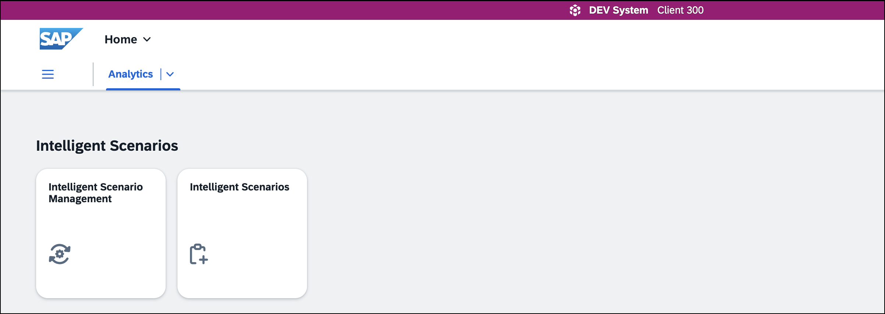

12\. Congratulations! You have successfully activated and assigned the required business role.

### Set Up bgRFC Queue
In this step, you configure the bgRFC queue in your SAP S/4HANA system to enable asynchronous background processing. ISLM uses the bgRFC queue for operations such as activation and deployment of intelligent scenarios. It consists of a supervisor destination, an inbound destination, and a scheduler. Together, these components ensure reliable processing of asynchronous background tasks and the communication with SAP AI Core.

1\. Log on to your **SAP S/4HANA** system and open transaction **SBGRFCCONF** (bgRFC Configuration).

2\. Open the **Define Supervisor Dest.** [1] tab and choose **Create** [2].

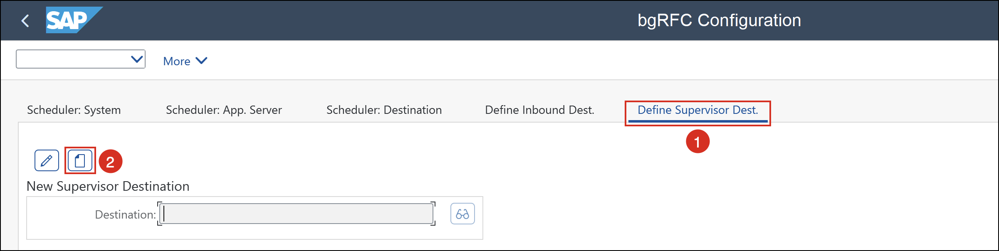

3\. In the **Create RFC Destination for Supervisor** dialog, enter `BGRFC_SUPERVISOR` as **Destination Name**, `BGRFC_SUPER` as **User Name**, and provide a password. Enable **Create User** if required.

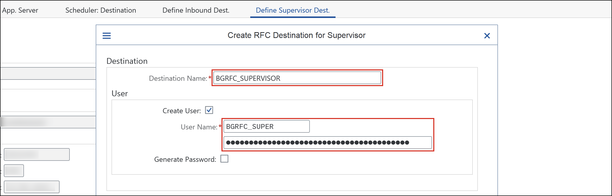

4\. Choose **Save**.

5\. Open the **Define Inbound Dest.** [1] tab and choose **Create** [2].

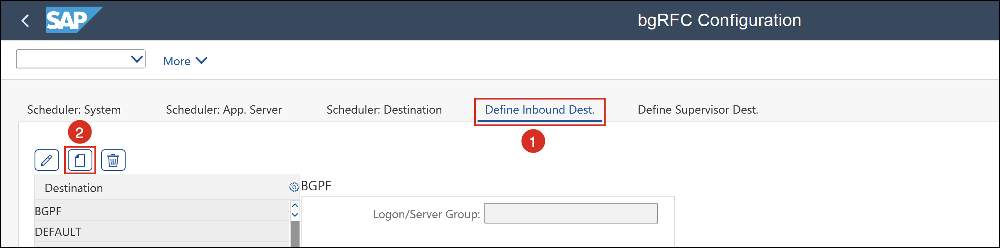

6\. In the **Configure Inbound Destination** screen, enter `ISLM_QBGRFC_INBOUND_DEST` as **Inb. Dest. Name** [1] and add `ISLM_` as a **Queue Prefix** [2].

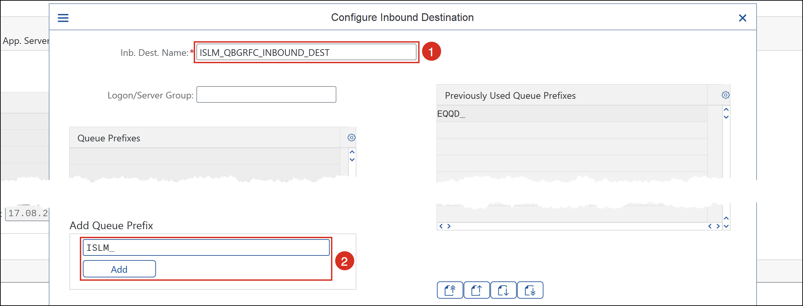

7\. Choose **Save**.

8\. Open the **Scheduler: Destination** [1] tab and choose **Create** [2].

The scheduler ensures that queued background tasks are processed automatically.

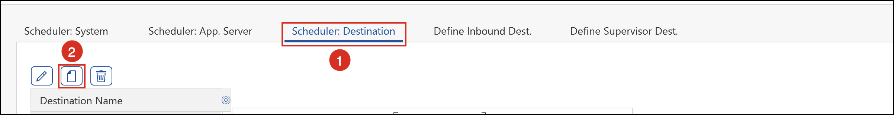

9\. In the dialog, select `Inbound` to create a scheduler for inbound processing.

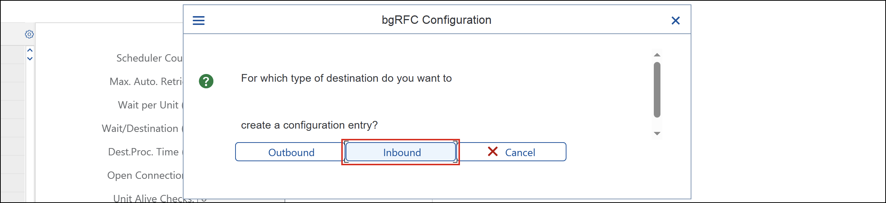

10\. In the **Create Scheduler Settings for Inbound Destination** screen, select `ISLM_QBGRFC_INBOUND_DEST` and choose **Save**.

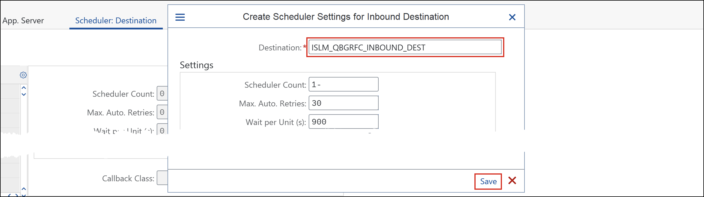

11\. Choose **Save** again to finalize the scheduler configuration.

12\. Congratulations! You have successfully configured the bgRFC queue for ISLM.

### Test yourself
Test your understanding of the concepts covered in this tutorial. Select the correct answer and choose **Check Answer**.

---