 
# Implement a Simple Custom ABAP AI Scenario in Your SAP S/4HANA System

<!-- description --> Learn how to implement a simple Intelligent Scenario using the ABAP AI SDK powered by Intelligent Scenario Lifecycle Management (ISLM).

## You will learn  
- How to create an Intelligent Scenario in the Intelligent Scenarios Application
- How to deploy and activate the Intelligent Scenario in the Intelligent Scenario Management Application
- How to use the Intelligent Scenario in a simple ABAP Class 

## Prerequisites
You have successfully configured your system as described in [Set Up SAP BTP and Integrate SAP AI Core with ISLM](abap-islm-setup-oauth).


---

## Pre-Read
Intelligent Scenario Lifecycle Management (ISLM) features the creation and deployment of an intelligent scenario (INTS). This intelligent scenario facilitates the interaction with a large language model (LLM) deployment on SAP AI Core in custom ABAP AI scenarios. The runtime APIs for this purpose are provided by the ABAP AI SDK powered by ISLM. More information can be found in the [Developing Your Own AI-Enabled Applications](https://help.sap.com/docs/abap-ai/generative-ai-in-abap-cloud/developing-your-own-ai-enabled-applications?version=s4_hana) documentation.


### Create an Intelligent Scenario

**Goal:** Let's first create and publish the intelligent scenario.

1. In the SAP Fiori launchpad of your SAP S/4 HANA system, choose the Intelligent Scenarios Fiori Application tile as depicted below. Alternatively, you may start in the SAP GUI and start transaction ```F4469```
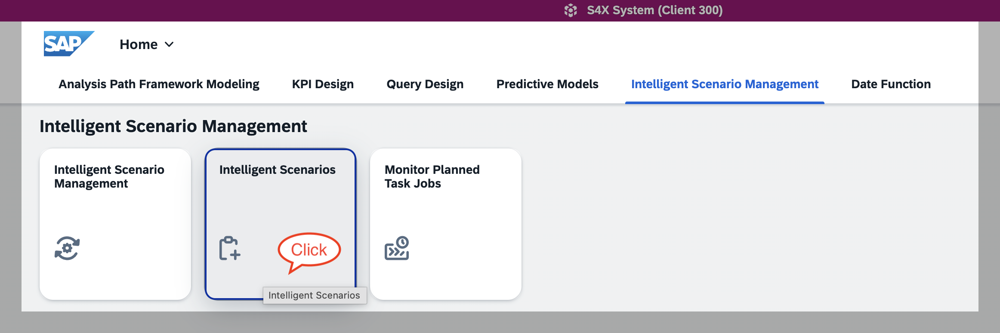

2. Create a ```Side-by-Side``` intelligent scenario (INTS)


1. In the creation screen, first configure the intelligent scenario type ```Generative AI```, which adjusts the Fiori creation screen. You can now provide the mandatory information for the INTS, e.g. the INTS name `ZDEMO_INTS`. Make sure to additionally provide the ```Usage Type```.
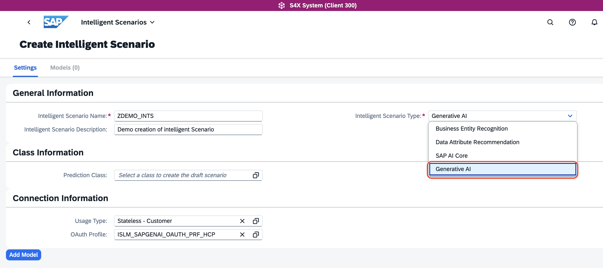

1. Click on  ```Add Model```, which opens the configuration of the Intelligent Scenario Model (INTM), which will be named `ZDEMO_INTM` in this tutorial. This intelligent scenario model holds the details of the large language model. You may choose from the list of supported providers and available models. In this tutorial, we are using the LLM as depicted below
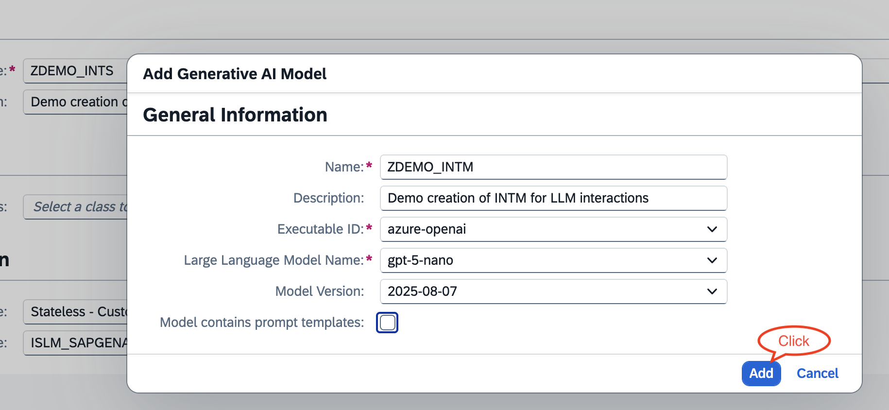
> **NOTE:** For simplicity, this tutorial omits the usage of prompt templates. This will be touched in a following tutorial.

1. Finally, publish the intelligent scenario. This step registers the intelligent scenario in the ISLM framework
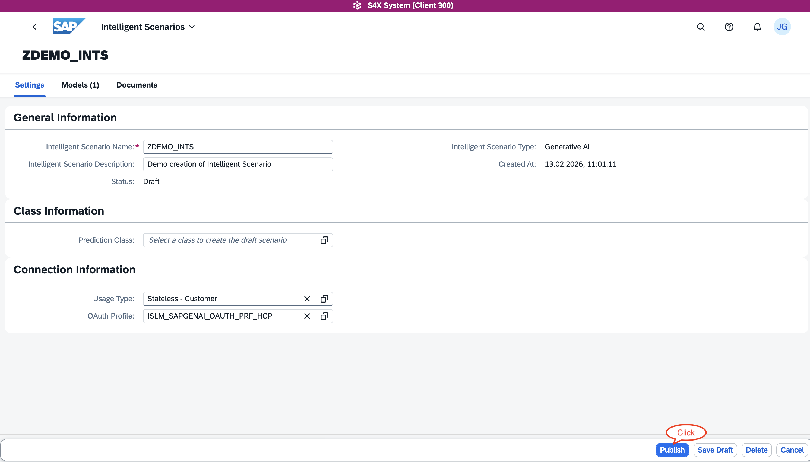

1. The intelligent scenario (and the intelligent model) are transportable ABAP development artefacts. You may choose a dedicated package, e.g. in ```Z-/Y-```namespace, which would further lead to transport management dialogues. For simplicity, in this tutorial we use the ```$TMP``` package
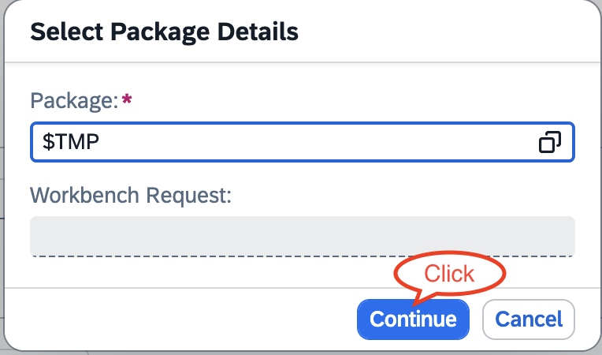

1. Finally, confirm the publishing of the intelligent scenario
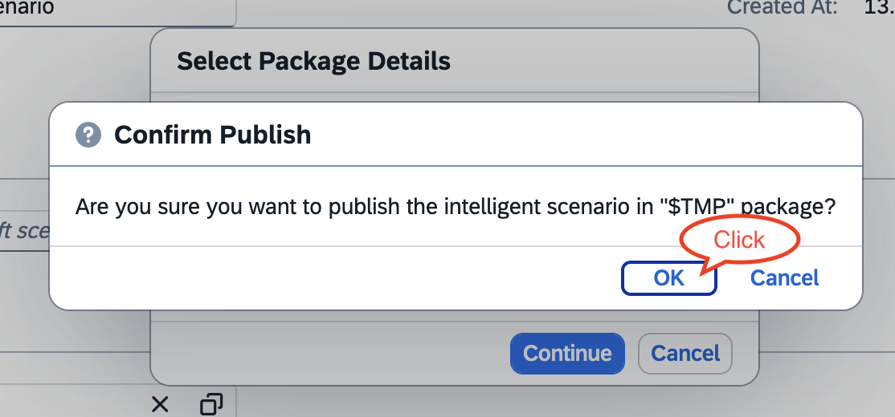

**Conclusion:** The intelligent scenario is now available in the ISLM framework. 

### Deploy and Activate the Intelligent Scenario

**Goal:** Let's continue with the deployment and activation of the just created Intelligent Scenario in order to facilitate interactions with an LLM deployment.

Deploying the intelligent scenario technically creates a deployment in your SAP AI Core instance. This deployment can then be used to interact with a large language model defined in your intelligent scenario respectively the related intelligent scenario model.

1. Choose the Intelligent Scenario Management Fiori tile in your SAP Fiori launchpad as depicted below. Alternatively, you may start again from SAP GUI using transaction ```F4470```


2. Choose the previously created and published intelligent scenario. Navigate to the detailed screen by clicking on the ```>``` icon
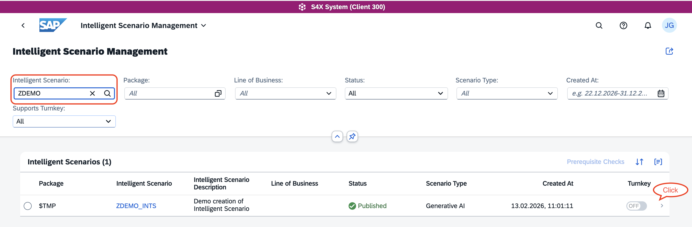

3. Navigate to the detailed screen by clicking on the ```>``` icon
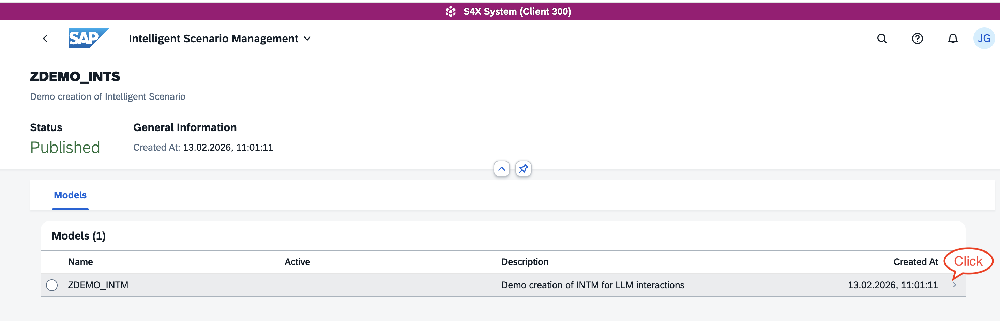
> **NOTE:** In case you see an information about lacking synchronisation, this depends on the system configuration. There may be a delay before the required information has been synchronized with you BTP AI Core Instance (standard configuration: 5 minutes). You may need to wait up to 5 minutes until the synchronisation finished. 

4. Choose from the available trainings (there should be only one visible) and ```Deploy```, which actually creates an LLM deployment on SAP AI Core
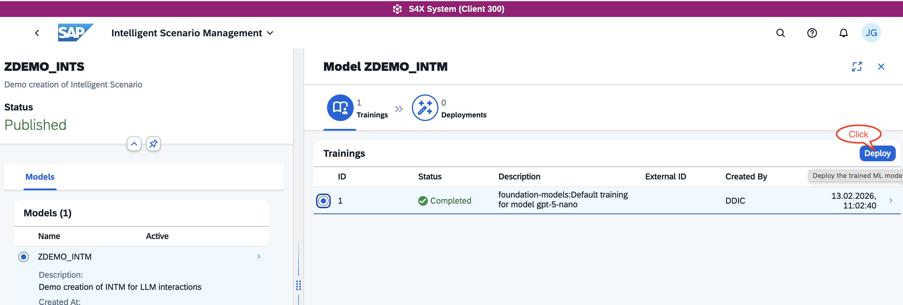

5. Check the deployment details displayed, you may change the deployment description or just accept the proposed text
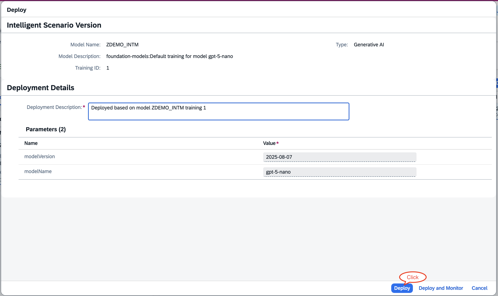

6. The status of the deployment will first change to pending
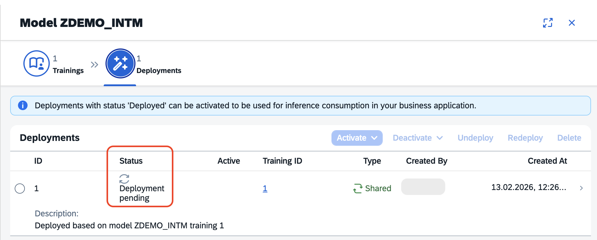
> **NOTE:** You may be lucky and don't see this intermediate deployment state - depends on the scheduled background job. So don't worry and just proceed.

7. Once the deployment status changes to ```Deployed```, you can proceed by activating the LLM deployment. Choose the ```For All``` to activate it for the usage by all users
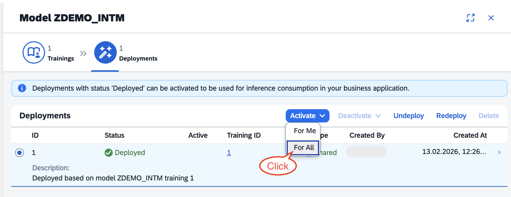

8. You'll be asked to confirm the activation method
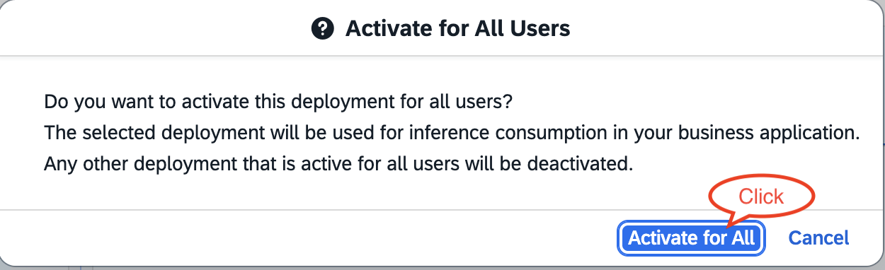

9. Finally, the LLM deployment is activated
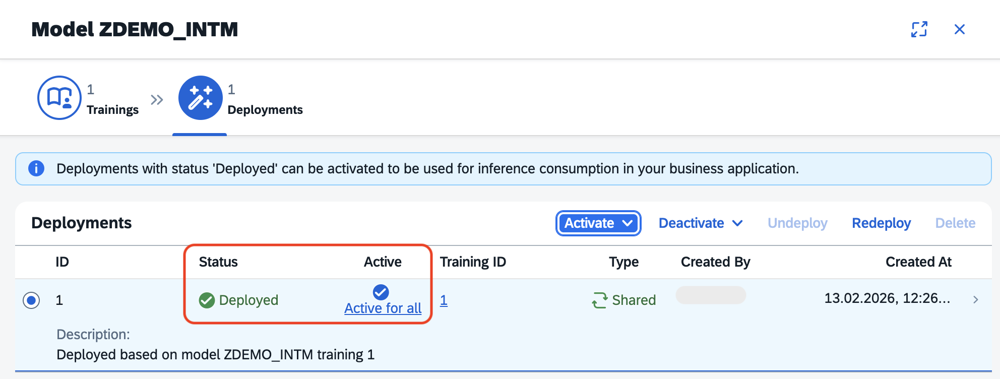

**Conclusion:** Well done! You are ready to consume the intelligent scenario, i.e. you are ready to interact with an LLM - let's do so in the next step!


### Consume the Intelligent Scenario in a simple ABAP Class

**Goal:** Now that you've successfully published and activated the intelligent scenario in the ABAP system, it's time to consume it in your ABAP coding. For ease of understanding, this tutorial uses a simple ABAP class including a console output, but you may of course use more complex ABAP logic. 

1. Use ABAP Development Tools in Eclipse, for creating an ABAP class containing the following ABAP coding. Be aware to adapt the intelligent scenario name in case you did choose something else than ```ZDEMO_INTS```

``` ABAP
CLASS zdemo_islm_simple DEFINITION
  PUBLIC
  FINAL
  CREATE PUBLIC .

  PUBLIC SECTION.
  INTERFACES if_oo_adt_classrun.
  PROTECTED SECTION.
  PRIVATE SECTION.
    DATA: user_message TYPE string,
          system_role  TYPE string.

    CONSTANTS:
      ints    TYPE islm_de_sbs_is_name VALUE 'ZDEMO_INTS'.
ENDCLASS.

CLASS zdemo_islm_simple IMPLEMENTATION.
  METHOD if_oo_adt_classrun~main.
    user_message = |Dear Joe, I'm Jane Doe, and I'm interested in joining your AI team. I have a basic understanding of computers | &&
                   |and I'm excited about AI.| &&
                   |Key highlights of my profile:| &&
                   |Completed an online course on basic computer skills (2015)| &&
                   |Familiar with Microsoft Office and Google Suite | &&
                   |Enjoy working with people and have experience in customer service | &&
                   |Willing to learn and take on new challenges | &&
                   |I'm looking for a new opportunity and think your team might be a good fit. Please find my resume attached. | &&
                   |Best regards,| &&
                   |Jane Doe | &&
                   |(jane.doe@email.com, 555-901-2345)|.
    system_role = |Briefly summarize the user input, i.e. give a personal description, | &&
                  |summarize and rate if this person | &&
                  |fits into our team of AI enthusiats.|.

    TRY.
        DATA(api) = cl_aic_islm_compl_api_factory=>get( )->create_instance( islm_scenario = ints ).
        DATA(container) = api->create_message_container( ).
        container->set_system_role( system_role = system_role ).
        container->add_user_message( message = user_message ).

        DATA(res) = api->execute_for_messages( messages = container )->get_completion( ).
        out->write( res ).
      CATCH cx_aic_api_factory INTO DATA(cx_factory).
        out->write( cx_factory->get_longtext( ) ).
      CATCH cx_aic_completion_api INTO DATA(cx_completion).
        out->write( cx_completion->get_longtext( ) ).
    ENDTRY.
  ENDMETHOD.

ENDCLASS.
```

2. You can activate and run the ABAP Class, using `Run as > ABAP Application (Console)`, resulting in an output on the ABAP console like

``` Text
Summary
- Jane Doe: basic computer skills, completed an online course on basic computer skills (2015).
- Familiar with Microsoft Office and Google Suite.
- Experience in customer service and enjoys working with people.
- Eager to learn, open to new challenges, seeking a new opportunity. Contact: jane.doe@email.com, 555-901-2345.

Fit for an AI-enthusiast team (short rating)
- Overall fit: Moderate — 3/5.
  - Strengths: enthusiasm, customer-facing experience, collaboration skills, willingness to learn — valuable for community, project coordination, documentation, or client-facing roles on an AI team.
  - Gaps: lacks technical AI/ML skills (no programming, data, or machine learning experience listed), which limits fit for core engineering or research roles.

Quick suggestions to improve fit
- Learn Python and basic data handling (pandas, NumPy).
- Take introductory AI/ML courses (e.g., Coursera/fast.ai) and build small projects (chatbot, dataset exploration).
- Contribute to documentation, testing, or community support to get into an AI team without heavy coding initially.
- Create a simple portfolio or GitHub with any projects and list recent trainings to demonstrate growth.
```

**Conclusion:** Wohoo, you finished your (first) custom ABAP AI scenario, interacting with a large language model deployed on SAP AI Core using the Intelligent Scenario Lifecycle Management framework!

### Test yourself

---


